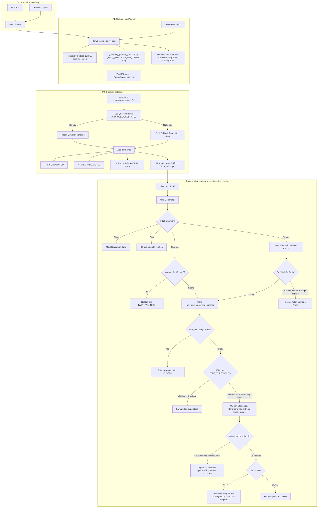

# ĐẶC TẢ VÀ ĐỀ XUẤT CHÍNH SÁCH NGÂN SÁCH LƯỢT PHỎNG VẤN ĐỘNG (GATE 1)
**Tài liệu Phân tích Kiến trúc & Mô phỏng Ngân sách Phỏng vấn (P1 / P2 / Runtime / P4)**  
*Dự án: INTERVIA — Interview Chat Core*  
*Nhánh: `feat/interview-text-runtime`*  
*Ngày cập nhật: 02/10/2026*
*Trạng thái: Gate 4 text runtime đã được Product duyệt semantics; Gate 3 ADR vẫn chờ Formal Lead Architect sign-off; production tiếp tục dùng `interview-planner-v1`; Gate 5/P4 chưa được tuyên bố hoàn tất*

---

## PHỤ LỤC PHÊ DUYỆT GATE 4 TEXT RUNTIME — 02/10/2026

Phụ lục này là contract có hiệu lực cho Gate 4 và thay thế các mô tả Gate 4 còn ghi “chờ Product duyệt” ở các phần cũ của tài liệu. Phạm vi phê duyệt chỉ gồm text runtime; không phải phê duyệt ADR Gate 3, Gate 5/P4, Question Bank hay Dynamic Planner production.

- **Pacing / Closing**: Runtime chuyển sang `BEHAVIORAL` khi pacing yêu cầu và trong frozen queue có một Behavioral turn hợp lệ. `CLOSING` chỉ được mở sau khi Behavioral hoàn tất và thời gian còn lại `>= 180s`; không được mở Closing trước Behavioral. Nếu queue không có Behavioral, runtime tiếp tục assessment turn còn lại đến Emergency Turn Cutoff `<= 90s`; nếu assessment queue hết trước đó thì đóng an toàn. Không tự sinh Behavioral question hoặc Closing.
- **Fast-fail**: Điểm thấp và `is_sufficient=False` không kết thúc session. Hai lần explicit Give Up liên tiếp chỉ tạo `FAST_FAIL_TECH` tại Technical stage (`DEEP_DIVE`/`CHALLENGE`). `VALIDATE` không fast-fail vì điểm thấp, thiếu evidence hay Give Up; requirement bị từ chối xác minh không được coi là đã thẩm định.
- **Abort / Clarify**: Tín hiệu abort có precedence cao hơn Clarify. Runtime trả `CONFIRM_ABORT` và không đóng session trước khi ứng viên xác nhận; chỉ Clarify khi không có tín hiệu abort.
- **Counter contract**: `consecutive_uncooperative` là tên canonical. Chỉ explicit Give Up làm tăng counter; answer yếu, insufficient, Clarify và một câu “Không” hợp lệ không tăng counter. `consecutive_fails` là compatibility alias deprecated tại boundary và phải có cùng giá trị; score không cập nhật counter.
- **Probe / budget**: Product chọn Decision 6B và 8A. Gate 4 không thêm `max_runtime_probes` cấp session; probe chỉ theo guard cục bộ hiện hành. Phần `T_probe_pool` chưa dùng được giữ làm safety buffer, không reclaim để cấp thêm câu.
- **UI**: Product chọn Decision 3A: stage stepper và thời gian còn lại, không hiển thị lượt cố định `X/N`. Đây là AC cho checkpoint Frontend riêng, chưa triển khai Frontend trong Gate 4 Runtime.
- **Production boundary**: Caller production tiếp tục dùng `interview-planner-v1`; không bật Dynamic Planner production trong checkpoint này.

---

## 1. TỔNG QUAN HIỆN TRẠNG & ĐẶT VẤN ĐỀ

Hệ thống phỏng vấn INTERVIA hiện áp dụng quy trình chia pha độc lập:
- **P0**: Trích xuất dữ liệu chuẩn hóa từ CV và JD (`src/modules/matching/facade.py`).
- **P1 (`src/modules/interviews/planner.py`)**: Lập kế hoạch phân bổ năng lực (Competency Agenda) và chia section.
- **P2 (`src/modules/interviews/question_selector.py`)**: Chọn và đóng băng (freeze) câu hỏi từ Ngân hàng câu hỏi (Question Bank) hoặc tạo fallback prompt nếu thiếu câu.
- **Runtime (`src/modules/interviews/chat_runtime.py` + `src/modules/interviews/core/interview_engine.py`)**: Điều phối lượt chat hai chiều, phát hiện ý định ứng viên, kích hoạt câu hỏi đào sâu (probe), điều hòa nhịp độ (pacing) và kết thúc phiên.
- **P4 (`src/modules/interviews/evaluation/evaluation_engine.py` + `src/modules/interviews/evaluation/evaluation_service.py`)**: Đánh giá câu trả lời theo tiêu chí rubric đưa vào prompt và trích xuất cấu trúc STAR.

### 1.1. Thống nhất định nghĩa các loại lượt trong hệ thống
Để tránh nhầm lẫn giữa hàng đợi chuẩn bị trước phiên và các lượt phát sinh theo diễn biến thực tế, tài liệu sử dụng nhất quán 4 khái niệm:
1. **`P2 frozen turns`**: Các lượt câu hỏi được P2 chọn, khởi tạo sẵn và đóng băng trong cơ sở dữ liệu (`interview_turns`) trước khi ứng viên bắt đầu phỏng vấn. Bao gồm: Turn 0 (Warm-up), Turn 1 (CV-Validate), các câu hỏi chuyên môn (từ Question Bank hoặc Fallback) và Turn cuối (Behavioral STAR).
2. **`runtime follow-up` (Probe / Clarify)**: Câu hỏi đào sâu phát sinh động tại Runtime khi ứng viên trả lời chưa đủ ý (`not is_sufficient`). Lượt này **không** nằm trong `P2 frozen turns`.
3. **`runtime closing` (Closing Q&A)**: Lượt hỏi đáp ngược (ứng viên hỏi AI) chỉ được mở sau khi một Behavioral turn hợp lệ đã hoàn tất và thời gian thực tế còn dư $\ge 180$ giây. Runtime ưu tiên frozen Closing turn hợp lệ nếu boundary đã cung cấp; nếu không, Runtime mới sinh Closing Q&A. Frozen Closing không được phép bypass Behavioral.
4. **`completed turns`**: Tổng số lượt thực sự được ứng viên và hệ thống hoàn tất trong suốt phiên phỏng vấn (bao gồm cả các câu P2 hoàn tất, probe và closing).

### 1.2. Vấn đề cốt lõi phát hiện trong mã nguồn
1. **Lệch pha ngân sách giữa P1 và P2 (Gây phình câu hỏi trong P2)**:
   - P1 phân bổ chỉ tiêu câu hỏi kỹ thuật theo hàm bậc thang thời lượng (`_question_budget`: $\le 15$m: 2 câu; $\le 30$m: 4 câu; $\le 50$m: 6 câu; $> 50$m: 8 câu).
   - Tuy nhiên, tại `src/modules/interviews/question_selector.py:494`, P2 lại áp đặt logic cưỡng bức: `needed = max(target["targetQuestionCount"], 2)` cho **từng** target.
   - *Hệ quả*: Số lượng câu hỏi kỹ thuật bị phình theo công thức: $\text{tech\_turns} = \sum_{i=1}^K \max(\text{targetQuestionCount}_i, 2)$. Ví dụ JD có 4 competencies (P1 giao mỗi target 1 câu), P2 tự động nhân đôi thành $4 \times 2 = 8$ câu kỹ thuật.
   - Khi cộng thêm Turn 0 (Warm-up), Turn 1 (CV-Validate) và Turn cuối (Behavioral STAR), tổng số `P2 frozen turns` bị đẩy lên $2 + 8 + 1 = \mathbf{11\text{ câu}}$ cho một phiên 25 phút.
2. **Runtime điều phối theo tỷ lệ đồng hồ và cơ chế Pacing thực tế**:
   - Runtime trong `src/modules/interviews/core/interview_engine.py` khai báo từ điển `TIME_THRESHOLDS`: WARM_UP 10%, VALIDATE 30%, DEEP_DIVE 75%, CHALLENGE 85%, BEHAVIORAL 95%, CLOSING 100%.
   - **Rà soát thực tế mã nguồn điều phối**:
     - **Ngưỡng WARM_UP (10%)**: Khai báo trong `TIME_THRESHOLDS` nhưng **chưa được dùng trong logic chuyển stage của WARM_UP** (`interview_engine.py:890-898`). Nhánh Warm-up trong code chỉ kiểm tra hoàn thành 1 lượt là chuyển thẳng sang VALIDATE, không so sánh với `0.10`.
     - **Ngưỡng VALIDATE (30%)**: Thực sự được dùng (`elapsed_ratio < 0.30`).
     - **Ngưỡng DEEP_DIVE (75%)**: Thực sự được dùng (`elapsed_ratio < 0.75`). Khi chạm hoặc vượt 75%, runtime ưu tiên chuyển sang CHALLENGE hoặc BEHAVIORAL. Runtime **chỉ quay lại rút nốt câu trong pool `DEEP_DIVE` nếu trong queue không còn câu nào thuộc `CHALLENGE` hoặc `BEHAVIORAL`**.
     - **Ngưỡng CHALLENGE (85%)**: Thực sự được dùng (`elapsed_ratio < 0.85`).
     - **Ngưỡng BEHAVIORAL (95%)**: Thực sự được dùng (`elapsed_ratio < 0.95`).
   - **Quy tắc Probe**: Hạn chế cấm probe sau mốc 80% (`is_behind_schedule`) **chỉ áp dụng riêng cho hai stage `VALIDATE` và `DEEP_DIVE`** (`interview_engine.py:416-419`). Stage `CHALLENGE` theo mã nguồn hiện tại **vẫn được phép probe sau mốc 80%**. Stage `WARM_UP` bị khóa probe tuyệt đối (`should_probe = False`).
   - **Cơ chế ngắt phiên**:
     - *Emergency Turn Cutoff (90 giây)*: Khi chọn câu tiếp theo, nếu thời gian còn lại $\le 90$ giây ở **bất kỳ stage nào, bao gồm `WARM_UP`**, runtime chủ động đóng phiên (`InterviewStage.CLOSED, None`) để tránh giao câu mới khi không đủ giờ.
     - *Hard Session Timeout (30 giây)*: Khi ứng viên gửi câu trả lời, nếu thời gian còn lại $\le 30$ giây và chưa ở `CLOSING`, runtime lập tức ngắt phiên với lý do `HARD_TIMEOUT`.
3. **Định hướng ngân sách động đã được Product phê duyệt**:
   - Xóa bỏ tư duy áp đặt số câu cố định cho từng gói thời lượng (không cố định 15m = 2, 25m = 3 hay 4 câu).
   - Số lượt của mỗi phiên là **kết quả lập kế hoạch riêng của phiên đó**, phụ thuộc vào thời lượng phiên, số lượng và độ ưu tiên của competency, tín hiệu matching CV-JD, độ khó, bài tập coding, dự phòng probe và thời gian closing.

---

## 2. SƠ ĐỒ LUỒNG HIỆN TẠI (AS-IS ARCHITECTURE)

---

## 3. BẢNG KIỂM KÊ CÁC LOẠI LƯỢT TRONG HỆ THỐNG (INVENTORY)

| Loại lượt | Nơi tạo & Giai đoạn | Thuộc `P2 frozen turns`? | Có Rubric / Barem chuẩn? | P4 Evaluation có chấm điểm? | Trọng số & Cơ chế chấm thực tế trong code |
| :--- | :--- | :--- | :--- | :--- | :--- |
| **Câu chính Question Bank** | P2 (`question_selector.py:485`) | **CÓ** (Bị phình do `max(count, 2)`) | **CÓ** (Gắn `rubric_version_id` & `expected_points` từ DB) | **CÓ** | Trọng số 1.0. LLM nhận text rubric trong prompt để tự sinh điểm `score` tổng hợp (chưa có chấm điểm tách rời theo từng tiêu chí con). |
| **Warm-up (Chào hỏi)** | P2 (`question_selector.py:615`) | **CÓ** (P2 tự thêm vào Turn 0) | **KHÔNG** (`rubric = None`) | **CÓ** | Trọng số 0.0. Prompt chỉ thị LLM đánh giá tác phong, miễn trừ yêu cầu kỹ thuật, không tính vào điểm chuyên môn. |
| **Câu xác thực CV (Validate)** | P2 (`question_selector.py:642`) | **CÓ** (P2 tự thêm vào Turn 1) | **KHÔNG** (Câu hỏi sinh từ template CV) | **CÓ** | Trọng số 1.0. Đánh giá tính trung thực và độ hiểu biết về dự án trong CV. |
| **Competency Fallback** | P2 (`question_selector.py:507`) | **CÓ** (Khi Bank thiếu câu đạt chuẩn) | **KHÔNG** (`unreviewed_fallback`, rubric rỗng) | **CÓ** | Trọng số 1.0. LLM tự chấm dựa trên prompt thô; rủi ro thiếu chuẩn mực đánh giá. |
| **Behavioral (STAR)** | P2 (`question_selector.py:752`) | **CÓ** (P2 tự thêm vào Turn cuối) | **KHÔNG** (Dùng rubric mặc định theo khung STAR) | **CÓ** | Trọng số 1.0. Prompt chỉ thị bóc tách 4 cấu phần: Situation, Task, Action, Result. |
| **Probe / Clarify** | Runtime (`chat_runtime.py:631`) | **KHÔNG** (Là `runtime follow-up` phát sinh động) | Dùng chung rubric của câu chính hiện tại | **KHÔNG CHẤM RIÊNG** | Nội dung trả lời probe được gộp chung vào câu trả lời chính trước khi gửi sang P4. |
| **Closing Q&A (Ứng viên hỏi AI)** | Runtime (`chat_runtime.py`) | Thông thường **KHÔNG**; có thể dùng frozen Closing turn hợp lệ tại compatibility boundary | **KHÔNG** | **KHÔNG CHẤM** | Chỉ mở sau Behavioral hoàn tất và còn $\ge 180$s; chỉ lưu transcript, không tính điểm năng lực. |

---

## 4. MÔ PHỎNG HÀNH VI VỚI MÃ NGUỒN HIỆN TẠI (SIMULATION MATRIX)

### 4.1. Phân định dữ liệu: Dữ liệu trích xuất từ Code vs Giả định phân tích

> [!IMPORTANT]
> - **Dữ liệu trích xuất từ Code**:
>   - Công thức P1: `_question_budget(15m) = 2`, `_question_budget(25m) = 4`, `_question_budget(45m) = 6`.
>   - Giới hạn P1: `_MAX_QUESTIONS_PER_TARGET = 3` (`planner.py:49, 141`). Với 1 competency duy nhất, P1 chỉ cấp tối đa 3 câu (1 câu ngân sách dư không thể phân bổ).
>   - Công thức P2: `needed = max(target["targetQuestionCount"], 2)`.
>   - Cấu trúc `P2 frozen turns`: Turn 0 (Warm-up) + Turn 1 (CV-Validate) + các câu Tech + Turn cuối (Behavioral STAR).
>   - Ngưỡng thời gian Runtime khai báo: WARM_UP 10% (chưa dùng trong logic chuyển nhánh), VALIDATE 30%, DEEP_DIVE 75%, CHALLENGE 85%, BEHAVIORAL 95%.
>   - Quy tắc Probe: `is_behind_schedule` cấm probe ở `VALIDATE` và `DEEP_DIVE` khi `elapsed > 80%`; cho phép probe ở `CHALLENGE`; cấm probe ở `WARM_UP`, `BEHAVIORAL`, `CLOSING`.
>   - Ngắt phiên: Emergency Cutoff $\le 90$s; Hard Timeout $\le 30$s; Reverse Q&A kích hoạt khi dư $\ge 180$s sau Behavioral.
>   - Cơ chế Fast-Fail: Ngắt phiên ngay lập tức khi ứng viên Give Up liên tiếp $\ge 2$ lần (`consecutive_fails >= 2`).
>
> - **Các giả định dùng để tính mô hình phân tích (Analytical Modeling Assumptions - Không phải chính sách sản phẩm)**:
>   - $t_{\text{wu}} = 1.5$ phút (Chào hỏi, giới thiệu nhanh).
>   - $t_{\text{cv}} = 2.0$ phút (Ứng viên chia sẻ dự án tiêu biểu).
>   - $t_{\text{tech}} = 2.5$ phút (Câu hỏi lý thuyết/kiến trúc chuẩn không có probe: đọc đề ~20s, gõ trả lời ~100s, LLM phản hồi & mạng ~20s, chuyển lượt ~10s).
>   - $\Delta t_{\text{probe}} = +2.0$ phút (Thời gian phụ trội khi có 1 lượt probe: LLM sinh probe ~15s, ứng viên đọc và trả lời ~100s).
>   - $t_{\text{coding}} = 6.0$ phút (Đọc spec ~45s, viết code ~240s, run test/debug & giải thích ~75s).
>   - $t_{\text{star}} = 3.5$ phút (Câu hỏi tình huống STAR chi tiết).
>   - $t_{\text{closing}} = 3.0$ phút (Lượt hỏi đáp văn hóa/dự án).
>   - Tổng thời lượng phiên chuẩn: $T = 25.0$ phút (1500 giây).

### 4.2. Bảng ma trận kịch bản mô phỏng chi tiết (Phiên chuẩn 25 phút)

Mỗi kịch bản dưới đây là **mô hình phân tích kịch bản dựa trên giả định (analytical scenario modeling)**, phân định rõ số liệu từ code và phép tính thời gian giả định:
$$\text{Thời gian thành phần} = \sum (\text{số lượt} \times \text{thời gian mỗi lượt})$$

Tất cả các dòng đều sử dụng thống nhất một định nghĩa đếm lượt:
- **`P2 frozen turns hoàn tất`**: Số câu hỏi đóng băng trong DB được thực sự hỏi và trả lời xong ($X / Y$).
- **`runtime follow-up`**: Số câu hỏi đào sâu (probe) phát sinh trong lúc chat.
- **`runtime closing`**: Lượt hỏi đáp ngược mở thêm ở cuối phiên.
- **`completed turns`**: Tổng lượt tương tác thực tế = P2 turns hoàn tất + probe + closing.

| Scenario | Cấu hình & Trọng số Competency | Tình trạng Bank | Số lượt Probe giả định | P1 Phân bổ (Code) | P2 Frozen Turns (Code) | Lượt hoàn tất (Ước tính theo giả định) | Tổng thời gian ước tính & Công thức kiểm tra | Đánh giá hành vi theo logic code |
| :--- | :--- | :--- | :--- | :--- | :--- | :--- | :--- | :--- |
| **SC-01** | 1 Competency duy nhất (vd: Python Junior) | Đủ câu Bank | 1 probe ở Tech 1 | **3 câu** (Budget = 4 nhưng chạm trần `_MAX_QUESTIONS_PER_TARGET = 3`, 1 câu dư không phân bổ được) | **6 câu** (1 wu + 1 cv + 3 tech + 1 star) | **6 / 6 P2 turns** + 1 probe + 1 closing = **8 completed turns** | **19.5 phút** `t = 1.5(wu) + 2.0(cv) + 3*2.5(tech) + 1*2.0(probe) + 3.5(star) + 3.0(closing)` `t = 1.5 + 2.0 + 7.5 + 2.0 + 3.5 + 3.0 = 19.5m` | Căn cứ `planner.py:141`: Với 1 target, P1 chỉ cấp tối đa 3 câu. P2 tạo 3 tech bank. Xong Behavioral ở phút 16.5, thời gian dư $25 - 16.5 = 8.5\text{m} \ge 180\text{s} \rightarrow$ Mở `runtime closing` (3.0m). Dư 5.5 phút kết thúc sớm. |
| **SC-02** | 2 Competencies đều (Python 2 câu, SQL 2 câu) | Đủ câu Bank | 2 probes ở phần Tech | **4 câu** (mỗi target 2 câu) | **7 câu** (1 wu + 1 cv + 4 tech + 1 star) | **7 / 7 P2 turns** + 2 probes + 1 closing = **10 completed turns** | **24.0 phút** `t = 1.5(wu) + 2.0(cv) + 4*2.5(tech) + 2*2.0(probe) + 3.5(star) + 3.0(closing)` `t = 1.5 + 2.0 + 10.0 + 4.0 + 3.5 + 3.0 = 24.0m` | Kết thúc Behavioral ở phút 21.0. Dư $25 - 21 = 4.0\text{m} \ge 180\text{s} \rightarrow$ Kích hoạt `runtime closing` (3.0m). Kết thúc ở phút 24.0, còn 1.0m ($\le 90$s) kích hoạt ngắt an toàn. |
| **SC-03** | 2 Competencies lệch (Must-have 3 câu, Nice-to-have 1 câu) | Đủ câu Bank | 4 probes (1 cv, 3 tech) | **4 câu** (T1: 3 câu, T2: 1 câu) | **8 câu** (1 wu + 1 cv + 5 tech + 1 star; T2 phình max(1,2)=2) | **6 / 8 P2 turns** + 4 probes (bỏ 2 tech P2) = **10 completed turns** | **22.5 phút** `t = 1.5(wu) + 2.0(cv) + 3*2.5(tech) + 4*2.0(probe) + 3.5(star)` `t = 1.5 + 2.0 + 7.5 + 8.0 + 3.5 = 22.5m` | Sau 3 câu Tech chạm phút 19.0 ($76\% > 75\%$). Runtime ưu tiên chuyển sang Behavioral (3.5m) $\rightarrow$ kết thúc ở phút 22.5. Thời gian dư $2.5\text{m} = 150\text{s} < 180\text{s} \rightarrow$ **Không** mở closing. Bỏ 2 câu tech của target phụ. |
| **SC-04** | 4 Competencies chuẩn (API, DB, Cache, Docker) | Đủ câu Bank | 2 probes ở phần Tech | **4 câu** (mỗi target 1 câu) | **11 câu** (1 wu + 1 cv + 8 tech + 1 star; 4 target x 2) | **8 / 11 P2 turns** + 2 probes (bỏ 3 tech P2) = **10 completed turns** | **23.5 phút** `t = 1.5(wu) + 2.0(cv) + 5*2.5(tech) + 2*2.0(probe) + 3.5(star)` `t = 1.5 + 2.0 + 12.5 + 4.0 + 3.5 = 23.5m` | **Phình câu hỏi P2!** Hàng đợi tạo 11 câu. Làm được 5 câu tech thì chạm phút 20.0 ($80\% > 75\%$). Runtime chuyển sang Behavioral (3.5m) $\rightarrow$ phút 23.5. Còn lại $1.5\text{m} = 90\text{s} \le 90\text{s} \rightarrow$ Emergency Cutoff ngắt phiên. |
| **SC-05** | 6 Competencies rộng (Fullstack) | Đủ câu Bank | 0 probe | **4 câu** (P1 drop 2 comp; chọn top 4) | **11 câu** (1 wu + 1 cv + 8 tech + 1 star) | **10 / 11 P2 turns** + 0 probe (bỏ 1 tech cuối) = **10 completed turns** | **24.5 phút** `t = 1.5(wu) + 2.0(cv) + 7*2.5(tech) + 3.5(star)` `t = 1.5 + 2.0 + 17.5 + 3.5 = 24.5m` | *Đúng logic code*: Sau câu tech thứ 6 ở phút 18.5 ($74\% < 75\%$), runtime chưa chạm ngưỡng 75% nên **tiếp tục lấy câu tech thứ 7** (2.5m). Kết thúc câu 7 ở phút 21.0 ($84\% \ge 75\%$), lúc này mới chuyển sang Behavioral (3.5m) $\rightarrow$ phút 24.5. Thời gian còn lại 30s ($\le 90$s cutoff) $\rightarrow$ ngắt phiên an toàn, không mở closing. Hoàn tất 10/11 P2 turns, bỏ 1 câu tech cuối. |
| **SC-06** | 4 Competencies (Bank chỉ có 2 câu đạt chuẩn) | Thiếu câu Bank (2 bank, 6 fallback) | 0 probe | **4 câu** (mỗi target 1 câu) | **11 câu** (1 wu + 1 cv + 2 bank + 6 fallback + 1 star) | **10 / 11 P2 turns** + 0 probe (bỏ 1 fallback cuối) = **10 completed turns** | **24.5 phút** `t = 1.5(wu) + 2.0(cv) + 2*2.5(bank) + 5*2.5(fallback) + 3.5(star)` `t = 1.5 + 2.0 + 5.0 + 12.5 + 3.5 = 24.5m` | *Nhất quán với SC-05*: Giả sử queue xếp 2 câu Bank trước, 6 câu Fallback sau. Sau 2 Bank + 4 Fallback là phút 18.5 ($74\% < 75\%$), runtime tiếp tục rút câu Fallback thứ 5. Kết thúc câu Fallback 5 ở phút 21.0 ($84\% \ge 75\%$), chuyển sang Behavioral (3.5m) $\rightarrow$ phút 24.5. Còn lại 30s $\rightarrow$ ngắt phiên. Hoàn tất 10/11 P2 turns (2 Bank + 5 Fallback), bỏ 1 câu Fallback cuối. |
| **SC-07** | 2 Competencies (Có 1 bài tập Coding) | Đủ câu Bank | 1 probe ở bài Coding | **4 câu** (mỗi target 2 câu) | **7 câu** (1 wu + 1 cv + 3 tech + 1 code + 1 star) | **7 / 7 P2 turns** + 1 probe = **8 completed turns** | **22.5 phút** `t = 1.5(wu) + 2.0(cv) + 3*2.5(tech) + 1*6.0(code) + 1*2.0(probe) + 3.5(star)` `t = 1.5 + 2.0 + 7.5 + 6.0 + 2.0 + 3.5 = 22.5m` | P2 thay 1 câu lý thuyết bằng bài coding 6.0m. Hoàn tất toàn bộ 7 câu trong queue P2. Vì câu coding tốn thời gian nên khi xong Behavioral ở phút 22.5, thời gian dư $2.5\text{m} < 180\text{s} \rightarrow$ Không mở closing, kết thúc phiên an toàn. |
| **SC-08** | Bất kỳ (Ứng viên Give Up liên tiếp) | Bất kỳ | 0 probe (Cấm probe khi give-up) | 4 | 7 đến 11 | **4 / 7-11 P2 turns** (Ngắt sớm tại phút 4.5) = **4 completed turns** | **4.5 phút** `t = 1.5(wu) + 2.0(cv) + 0.5(give-up 1) + 0.5(give-up 2)` `t = 1.5 + 2.0 + 0.5 + 0.5 = 4.5m` | Turn 0 (Warm-up) và Turn 1 (CV) ứng viên trả lời bình thường. Đến Turn 2 (câu tech đầu) ứng viên Give Up lần 1. Đến Turn 3 ứng viên tiếp tục Give Up lần 2 $\rightarrow$ `consecutive_fails == 2` kích hoạt `FAST_FAIL_TECH` ngắt phiên tại phút 4.5. |

---

## 5. ĐỀ XUẤT CHÍNH SÁCH NGÂN SÁCH ĐỘNG (TO-BE SPECIFICATION)

### 5.1. Phân định ranh giới trách nhiệm P1 và P2 trong mô hình ngân sách động

> [!IMPORTANT]
> **Nguyên tắc phân định kiến trúc**: P1 lập kế hoạch vĩ mô (Agenda & Time Envelope), P2 tìm kiếm và tối ưu câu hỏi vi mô (Question Selection & Knapsack Packing). P1 **không cần biết trước** câu hỏi cụ thể nào sẽ được chọn trong Question Bank.

1. **Trách nhiệm của P1 (Competency Agenda & Time Envelope)**:
   - **Công thức tổng quát tính ngân sách chuyên môn khả dụng**:
     $$T_{\text{tech\_pool}} = T_{\text{session}} - \left( T_{\text{onboarding}} + T_{\text{cv\_standalone\_reserve}} + T_{\text{behavioral}} + T_{\text{probe\_pool}} + T_{\text{closing\_reserve}} \right)$$
     Trong đó:
     $$T_{\text{onboarding}} = T_{\text{onboarding\_base}} + T_{\text{cv\_addon\_inclusive}}$$
   - **Tách biệt tường minh tên biến theo vai trò hạch toán (Loại trừ triệt để tính trùng lặp)**:
     Nhằm tránh việc một biến mang hai nghĩa hoặc bị trừ hai lần, hệ thống chuẩn hóa 3 biến độc lập:
     + `T_onboarding_base`: Thời lượng mở đầu cơ sở bắt buộc (không gồm CV conditional follow-up). Giả định phân tích: ~90–120s (1.5–2.0 phút) cho Mode 1 lượt; ~210–270s (3.5–4.5 phút) cho Mode 2 lượt (1A).
     + `T_cv_addon_inclusive`: Phần thời gian CV conditional follow-up **được gộp trực tiếp vào tổng gói ngân sách mở đầu** $T_{\text{onboarding}}$ khi Product chọn **Cách 1 (Inclusive)**. Đây là thành phần cấu thành nên $T_{\text{onboarding}}$, **tuyệt đối KHÔNG trừ thêm độc lập** trong công thức $T_{\text{tech\_pool}}$. Giả định phân tích: ~90–120s (1.5–2.0 phút) khi chọn Inclusive kèm 1C.2b; bằng 0 trong tất cả các trường hợp khác.
     + `T_cv_standalone_reserve`: Quỹ thời gian bảo lưu riêng cho CV follow-up **được trừ độc lập khỏi $T_{\text{tech\_pool}}$** khi Product chọn **Cách 2 (Decoupled)** kết hợp Phương án **1C.2b**. Giả định phân tích: ~90–120s (1.5–2.0 phút) khi chọn Decoupled kèm 1C.2b; bằng 0 trong tất cả các trường hợp khác (1A, 1B, 1C.1, 1C.2a hoặc Cách 1 Inclusive).
   - **Nguyên tắc phân định và bảo toàn ngân sách với `T_probe_pool`**:
     + *Khi chọn 1C.1 hoặc 1C.2a (Dùng chung `T_probe_pool`)*: Lượt CV follow-up tiêu hao thời gian từ `T_probe_pool`. Cả hai biến quỹ riêng đều bằng 0: $T_{\text{cv\_addon\_inclusive}} = 0$ và $T_{\text{cv\_standalone\_reserve}} = 0$. $T_{\text{onboarding}} = T_{\text{onboarding\_base}}$. Thời gian CV follow-up được hạch toán đúng một lần bên trong `T_probe_pool`.
     + *Khi chọn 1C.2b (Cấp quỹ riêng qua Cách 1 Inclusive hoặc Cách 2 Decoupled)*: CV follow-up đã có quỹ thời gian riêng (nằm trong $T_{\text{cv\_addon\_inclusive}}$ hoặc $T_{\text{cv\_standalone\_reserve}}$). Do đó, `T_probe_pool` **chỉ dành riêng cho probe chuyên môn kỹ thuật**, hoàn toàn không gánh thêm lượt CV follow-up. Điều này ngăn chặn triệt để nguy cơ vừa gộp CV vào onboarding/quỹ riêng vừa giữ nguyên `T_probe_pool` bao gồm chính lượt CV đó (loại trừ double counting). Lựa chọn này được giữ ở trạng thái mở chờ Product phê duyệt tại Quyết định 1.
   - **Làm rõ bản chất và chính sách quyết toán `T_probe_pool`**:
     + *Bản chất & Quy mô*: `T_probe_pool` là khoản dự trữ thời gian vĩ mô trong kế hoạch P1 (macro planning reserve), được tính theo công thức $T_{\text{probe\_pool}} = \text{probe\_pool\_ratio} \times T_{\text{session}}$ (với tỷ lệ `probe_pool_ratio` = 15%–20%, tương ứng từng gói phiên: 15m $\rightarrow$ 135–180s; 25m $\rightarrow$ 225–300s; 45m $\rightarrow$ 405–540s), **KHÔNG PHẢI bộ đếm thời gian runtime thực thi đã có trong mã nguồn hiện tại**. Runtime hiện hữu (`interview_engine.py`) chỉ pacing cục bộ theo tỷ lệ thời gian `elapsed_ratio` từng turn; việc theo dõi cạn quỹ probe tại runtime là tính năng mới cần lập trình ở Gate 4.
     + *Khi không dùng hết `T_probe_pool`*: Theo Decision 8A được PO duyệt ngày 02/10/2026, phần dư được giữ lại làm buffer an toàn đến cuối phiên (cho Closing hoặc bù độ trễ mạng), không reclaim để cấp câu chuyên môn mới.
     + *Khi dùng hết `T_probe_pool`*: Nếu Gate 4 triển khai bộ đếm quỹ probe, runtime ngừng kích hoạt probe mới theo ngân sách thời gian, đồng thời vẫn áp dụng đầy đủ các điều kiện runtime khác (`not is_sufficient`, `consecutive_fails < 2`, cấm probe khi `elapsed > 80%` tại Validate/Deep Dive).
   - Sắp xếp thứ tự ưu tiên các competency dựa trên trọng số requirement (`must_have` vs `nice_to_have`) và tín hiệu matching (`unknown`, `not_met` được ưu tiên trước `met`).
   - Phân bổ cho từng competency mục tiêu một **ngân sách thời gian khả dụng (Time Envelope)**: $\text{time\_envelope}(c_i)$ theo thuật toán hạn ngạch quy định tại Mục 5.6.
   - Đưa ra ước tính định hướng số câu hỏi dựa trên archetype câu hỏi (ví dụ: archetype lý thuyết ước tính ~2.5–3.0m/câu; archetype coding ước tính ~5.0–6.0m/câu).
   - Nếu tổng thời gian $T_{\text{tech\_pool}}$ không đủ để bao phủ toàn bộ competency, P1 chuyển các competency còn lại vào `nonInterviewedTargets` có giải trình truy vết.
2. **Trách nhiệm của P2 (Candidate Query & Question Selection)**:
   - Nhận Time Envelope và định hướng archetype từ P1 cho từng competency.
   - Truy vấn Question Bank để lấy danh sách candidate questions đạt trạng thái `APPROVED` hoặc `CALIBRATED`.
   - Đọc metadata thực tế của từng câu hỏi:
     - **Tên trường hiện hữu trong DB/Schema** (`src/modules/question_bank/schemas.py`):
       - `soft_answer_seconds` (alias `softAnswerSeconds`): Thời lượng trả lời khuyến nghị mềm (ví dụ 120s, 180s).
       - `hard_answer_seconds` (alias `hardAnswerSeconds`): Trần thời gian tối đa ngắt câu hỏi (ví dụ 180s, 240s, 300s).
       - `question_type`: Phân loại câu hỏi (`text` vs `coding`).
     - **Chỉ số tính toán đề xuất (Derived Estimate Proposal)**:
       - $t_{\text{expected}}$: Ước tính tổng thời gian một lượt, được P2 tính từ $t_{\text{expected}} = \text{soft\_answer\_seconds} + \text{buffer\_read\_and\_latency}$. Đây là chỉ số đề xuất mới, không phải cột dữ liệu có sẵn trong DB.
   - Chọn số lượng câu hỏi tối ưu sao cho tổng $t_{\text{expected}}$ của các câu được chọn nằm vừa vặn trong Time Envelope của target đó.
   - **Ràng buộc tuyệt đối**: P2 không được tự ý nhân đôi hay tăng số câu hỏi vượt quá Time Envelope mà P1 đã giao.

### 5.2. Chính sách ưu tiên Competency & Bảo vệ `must_have` khả thi
- **Không đặt mục tiêu phi thực tế "100% must-have luôn được hỏi"** khi thời lượng phiên có hạn.
- Thay vào đó, áp dụng cơ chế bảo vệ khả thi:
  1. 100% các yêu cầu `must_have` có trạng thái `unknown` hoặc `not_met` được ưu tiên xếp vào nhóm Rank 1..K để đưa vào Time Envelope trước các yêu cầu `nice_to_have`.
  2. Bất kỳ competency nào không thể đưa vào kế hoạch do giới hạn thời lượng phiên phải được lưu trữ minh bạch trong `nonInterviewedTargets` kèm trường `omission_reason: "insufficient_session_duration"` và giải trình truy vết.
  3. Trong báo cáo đánh giá cuối phiên P4, hệ thống bắt buộc phân biệt rõ:
     - **Năng lực đã thẩm định trong phiên (Assessed)**.
     - **Năng lực chưa thẩm định do giới hạn thời lượng phiên (Not Assessed Due to Time Constraint)**.
  4. Tuyệt đối không coi các năng lực chưa thẩm định là bằng chứng ứng viên không đạt yêu cầu.

### 5.3. Chính sách thiếu câu hỏi trong Question Bank (Deficit Policy)

Tài liệu phân định rõ hai loại câu hỏi và chế độ áp dụng:
1. **Phân loại câu hỏi**:
   - **Câu hỏi chuẩn hóa (`APPROVED` / `CALIBRATED`)**: Có `question_version_id` và `rubric_version_id` hợp lệ, rubric được kiểm định chất lượng, điểm số có giá trị tin cậy cao.
   - **Câu hỏi Fallback Prompt**: Do hệ thống tự sinh từ template khi ngân hàng thiếu câu, không có rubric kiểm duyệt (`rubric = None`). Điểm số từ câu fallback phụ thuộc vào suy luận tự do của LLM nên **không có giá trị tương đương câu đã hiệu chuẩn**.
2. **Chính sách theo Chế độ vận hành**:
   - **Chế độ Tuyển dụng chính thức (Formal Assessment Mode)**:
     - Hệ thống thực hiện Pre-flight Bank Check trước khi mở phiên.
     - Nếu một competency thiếu câu hỏi đạt chuẩn, hệ thống tự động bỏ qua competency đó để chọn competency tiếp theo trong JD có sẵn câu hỏi chuẩn.
     - Nếu toàn bộ JD không có câu hỏi nào đạt chuẩn trong Question Bank, hệ thống **từ chối mở phiên** và thông báo lỗi minh bạch: `question_bank_insufficient`. Tuyệt đối không âm thầm sử dụng câu fallback trong chế độ chính thức.
   - **Chế độ Luyện tập / Khảo sát (Mock Practice Mode)**:
     - Nếu Product cho phép tiếp tục phiên bằng Fallback Prompt để ứng viên trải nghiệm, hệ thống phải:
       - Gắn cờ metadata: `is_unreviewed_fallback: true`.
       - Hiển thị thông báo trên giao diện phòng thi: *"Câu hỏi luyện tập (chưa chuẩn hóa rubric)"*.
       - Trong báo cáo P4, ghi chú rõ: *"Điểm số câu hỏi này chỉ mang tính tham khảo, không dùng trong quyết định tuyển dụng"*.

### 5.4. Đánh giá câu trả lời tại P4 (Evaluation Engine Reality)
- Căn cứ trực tiếp từ mã nguồn `src/modules/interviews/evaluation/evaluation_engine.py`:
  - P4 đưa nội dung tiêu chí rubric vào prompt của LLM (`rubric_criteria or 'Đánh giá kiến thức thực tế và giải pháp kỹ thuật'`).
  - LLM thực hiện: bóc tách 4 cấu phần STAR (Situation, Task, Action, Result), trích dẫn bằng chứng `evidence_quotes`, nhận xét điểm mạnh/yếu, và sinh một điểm số float duy nhất `score` (thang điểm 0.0 đến 10.0).
  - **Lưu ý thiết kế**: P4 hiện tại **chưa có cơ chế chấm điểm có cấu trúc độc lập theo từng tiêu chí con (structured multi-criterion scoring)**, mà dựa vào LLM tự cân nhắc rubric trong prompt để đưa ra điểm số tổng hợp.

### 5.5. Phân định tham số cấu hình cần duyệt vs Giả định phân tích

Tài liệu phân định rõ hai nhóm thông số để không gây mâu thuẫn nhãn:

#### Nhóm A: Tham số cấu hình chính sách hệ thống [Cần Product phê duyệt]
Các tham số dưới đây quy định trực tiếp hành vi phân bổ ngân sách và điều phối phiên:

| Tham số cấu hình | Giá trị đề xuất | Ý nghĩa nghiệp vụ | Quyết định liên quan |
| :--- | :--- | :--- | :--- |
| **`T_onboarding_base`** | 1.5 – 2.0 phút (Mode 1 lượt) hoặc 3.5 – 4.5 phút (Mode 2 lượt) | **[Giả định đề xuất - Chờ telemetry/Product duyệt]**: Thời lượng mở đầu cơ sở (Base Onboarding, không gồm CV conditional follow-up). Mode 1 lượt gồm chào hỏi tích hợp 1 turn (~90–120s); Mode 2 lượt (1A) gồm chào hỏi chung + thẩm định dự án CV (~210–270s). | Quyết định 1 (Phương án 1A, 1B, 1C). |
| **`T_cv_addon_inclusive`** | 90 – 120 giây khi chọn Cách 1 kèm 1C.2b; 0 giây trong các trường hợp khác | **[Giả định đề xuất mới - Chưa có trong Schema/DB, chờ telemetry/Product duyệt]**: Khoản thời gian dự phòng CV follow-up được **gộp trực tiếp vào tổng gói `T_onboarding`** theo Cách 1 (Inclusive). Là thành phần của `T_onboarding`, **không trừ riêng trong $T_{\text{tech\_pool}}$**. | Quyết định 1 (Cách 1 Inclusive). |
| **`T_cv_standalone_reserve`** | 90 – 120 giây khi chọn Cách 2 kèm 1C.2b; 0 giây trong các trường hợp khác | **[Giả định đề xuất mới - Chưa có trong Schema/DB, chờ telemetry/Product duyệt]**: Quỹ thời gian bảo lưu riêng cho CV follow-up **được trừ độc lập khỏi $T_{\text{tech\_pool}}$** khi chọn Cách 2 (Decoupled) kèm 1C.2b. Mặc định bằng 0 nếu chọn Cách 1 (đã gộp qua `T_cv_addon_inclusive`), hoặc 1A, 1B, 1C.1, 1C.2a. | Quyết định 1 (Cách 2 Decoupled & 1C.2b). |
| **`T_onboarding`** | Phụ thuộc Cách 1 (Inclusive) vs Cách 2 (Decoupled) | Thời lượng mở đầu phiên đưa vào công thức $T_{\text{tech\_pool}}$:  • **Cách 1 (Inclusive)**: Tổng gói $T_{\text{onboarding}} = T_{\text{onboarding\_base}} + T_{\text{cv\_addon\_inclusive}}$ (~3.0 – 4.0 phút cho Mode 1 lượt gồm cơ sở + dự phòng; ~3.5 – 4.5 phút cho Mode 2 lượt).  • **Cách 2 (Decoupled)**: Chỉ gồm cơ sở $T_{\text{onboarding}} = T_{\text{onboarding\_base}}$ (~1.5 – 2.0 phút cho Mode 1 lượt; ~3.5 – 4.5 phút cho Mode 2 lượt). | Quyết định 1 (Cách 1 vs Cách 2). |
| **`N_onboarding`** | 1 hoặc 2 lượt | Số lượt mở đầu tương ứng với mode cấu hình (1 lượt nếu gộp/conditional, 2 lượt nếu tách). | Quyết định 1 (Cách A: duyệt trước Gate 2; Cách B: Gate 2 nhận cấu hình tham số hóa). |
| **`T_behavioral`** | 3.0 – 4.0 phút | Thời gian dành cho câu hỏi tình huống STAR cuối phiên. | Chính sách chuẩn hóa STAR. |
| **`probe_pool_ratio`** (`T_probe_pool`) | 15% – 20% thời lượng phiên  ($T_{\text{probe\_pool}} = \text{probe\_pool\_ratio} \times T_{\text{session}}$: 15m $\rightarrow$ 135–180s; 25m $\rightarrow$ 225–300s; 45m $\rightarrow$ 405–540s) | Khoản dự trữ P1 vĩ mô. Theo Decision 8A, phần dư giữ làm safety buffer và không reclaim tại Runtime. | Chính sách điều phối Runtime Pacing & Quyết định 8A. |
| **`max_runtime_probes`** | Không áp dụng tại Gate 4 | **[PO duyệt Decision 6B ngày 02/10/2026]**: Không có trần/bộ đếm điều khiển cấp session; Runtime dùng guard cục bộ từng turn. Các giá trị 1/2/3 trong mô hình cũ không phải production contract. | Quyết định 6B. |
| **`closing_reserve_seconds`** | 180 giây (3.0 phút) | Thời gian tối thiểu cần bảo lưu để mở phần hỏi đáp ngược và kết thúc phiên. | Runtime Pacing Closing Cutoff. |
| **`buffer_read_and_latency`** | 30 – 45 giây / lượt | Thời gian overhead dự kiến cho ứng viên đọc đề và LLM sinh phản hồi. | Cơ chế ước lượng $t_{\text{expected}}$ của P2. |
| **`t_arch_text_min`** | 180 giây (3.0 phút) | Mức sàn thời gian tối thiểu cho competency lý thuyết/kiến trúc. | Thuật toán phân bổ Time Envelope. |
| **`t_arch_code_min`** | 360 giây (6.0 phút) | Mức sàn thời gian tối thiểu cho competency bài tập coding. | Thuật toán phân bổ Time Envelope. |
| **`t_probe_min`** | 60 – 90 giây | **[Giả định đề xuất mới - Chưa có trong Schema/DB]**: Mức sàn thời gian tối thiểu dự kiến của 1 lượt probe kỹ thuật (đọc câu hỏi làm rõ ~15s, trả lời ~35–60s, phản hồi ~10–15s). Phân biệt với các trường DB hiện có (`soft_answer_seconds`, `hard_answer_seconds`). | Giới hạn dung lượng `T_probe_pool` & Mục 5.6.4. |
| **`t_cv_followup_expected`** | 90 – 120 giây | **[Giả định đề xuất mới - Chưa có trong Schema/DB]**: Thời lượng dự kiến của 1 lượt hỏi CV conditional follow-up (đọc câu hỏi dự án ~20s, trình bày ~55–80s, phản hồi ~15–20s). | Quyết định 1 & Mục 5.6.4. |

#### Nhóm B: Giả định dùng để tính mô hình phân tích kịch bản (Analytical Assumptions)
Các con số dưới đây thuần túy là **đầu vào minh họa** dùng trong bảng ma trận Mục 4.2 để kiểm tra số học và đường đi trạng thái của code, **không phải chính sách sản phẩm và không cần Product duyệt**:
- $t_{\text{wu}} = 1.5$ phút; $t_{\text{cv}} = 2.0$ phút; $t_{\text{tech}} = 2.5$ phút; $\Delta t_{\text{probe}} = +2.0$ phút; $t_{\text{coding}} = 6.0$ phút; $t_{\text{star}} = 3.5$ phút; $t_{\text{closing}} = 3.0$ phút.

---

### 5.6. Đặc tả kỹ thuật chuẩn bị cho Gate 2 (P1 Planner Specification)

Để chuẩn bị triển khai Gate 2 (sửa `src/modules/interviews/planner.py`), dưới đây là 4 câu hỏi thiết kế kiến trúc, đề xuất kỹ thuật và lựa chọn Product cần chốt:

#### 1. P1 xác định mức sàn Time Envelope và phân bổ ngân sách như thế nào khi chưa biết câu hỏi cụ thể?
- **Cách xác định mức sàn theo Archetype mục tiêu khi P1 chưa biết câu hỏi cụ thể**:
  - Tại P1, hệ thống chưa truy vấn Question Bank nên chưa biết câu hỏi cụ thể nào sẽ được chọn. Tuy nhiên, P1 có thể suy đoán archetype định hướng căn cứ vào metadata năng lực, taxonomy và domain tags trích xuất từ P0 Canonical Matching và JD requirements:
    - *Competency dạng lý thuyết / kiến trúc / khái niệm / DevOps / hệ thống*: Được gán archetype `TEXT`, với mức sàn thời gian tối thiểu $t_{\text{floor}}(c_i) = t_{\text{arch\_text\_min}} = 180$ giây (3.0 phút). Dải thời lượng ước tính cho một câu hỏi text là $[t_{\text{arch\_text\_min}}, t_{\text{arch\_text\_max}}] = [180\text{s}, 240\text{s}]$.
    - *Competency dạng bài tập lập trình / coding* (có tags `coding_problem`, `data_structures`, `algorithm`, hoặc JD yêu cầu live coding / hands-on programming): Được gán archetype `CODING`, với mức sàn thời gian tối thiểu $t_{\text{floor}}(c_i) = t_{\text{arch\_code\_min}} = 360$ giây (6.0 phút). Dải thời lượng ước tính cho một câu hỏi coding là $[t_{\text{arch\_code\_min}}, t_{\text{arch\_code\_max}}] = [360\text{s}, 480\text{s}]$.
    - *Competency dạng lai (Hybrid)*: Nếu một competency có thể hỏi lý thuyết hoặc coding (ví dụ "Python Core"), P1 mặc định gán `TEXT` (180s) nếu $T_{\text{tech\_pool}}$ eo hẹp, hoặc chỉ gán `CODING` (360s) nếu thời lượng phiên đủ lớn và JD nhấn mạnh hands-on coding.
- **Xử lý target có thể nhận câu coding nhưng Time Envelope nhỏ hơn chi phí coding dự kiến (< 360 giây)**:
  - Trường hợp P1 gán archetype `TEXT` hoặc sau phân bổ trọng số mà $\text{time\_envelope}(c_i) < 360$ giây, nhưng khi sang P2 truy vấn Question Bank thì target này có thể nhận câu coding:
    - *Phương án 1 (Downgrade to Text - Khuyến nghị)*: P2 bị giới hạn chỉ được chọn câu hỏi lý thuyết/kiến trúc (`question_type == 'text'`) cho target này. P2 tuyệt đối không được chọn câu coding để bảo vệ quỹ thời gian, tránh làm vỡ kế hoạch phiên.
    - *Phương án 2 (Omission if Coding Mandatory)*: Nếu JD hoặc chính sách đánh giá quy định competency này bắt buộc phải thi code thực hành (không chấp nhận lý thuyết thay thế) mà Time Envelope sau phân bổ $< 360$s, P1/P2 không lên lịch cho target này mà chuyển vào danh sách `nonInterviewedTargets` với `omission_reason: "insufficient_envelope_for_coding_assessment"`.
    - *Phương án 3 (Target Consolidation)*: P1 chủ động giảm bớt 1 competency phụ khác để dồn ngân sách, nâng Time Envelope của target coding này lên tối thiểu 360s.
- **Cơ chế trần Time Envelope: Hard Ceiling vs Soft Ceiling [Cần Product phê duyệt]**:
  - *Lựa chọn 1: Hard Ceiling (Trần cứng)*: P2 tuyệt đối không được chọn câu hỏi có tổng thời lượng dự kiến vượt quá Time Envelope của target. Nếu Bank không có câu vừa vặn, phải áp dụng chính sách thiếu câu. (Ưu điểm: kiểm soát thời gian tuyệt đối, phiên không bao giờ trễ; Nhược điểm: có thể bỏ lỡ câu hỏi phù hợp nếu chênh lệch nhỏ).
  - *Lựa chọn 2: Soft Ceiling (Trần mềm)*: Cho phép P2 vượt nhẹ Time Envelope trong biên độ cho phép ($\le 15\%$ hoặc tối đa $+30$ giây), phần dôi dư sẽ được bù trừ bằng buffer an toàn runtime hoặc trừ vào target kế tiếp. (Ưu điểm: linh hoạt tận dụng Question Bank; Nhược điểm: tăng áp lực dồn toa thời gian ở cuối phiên).
  - *(Lựa chọn này được giữ ở trạng thái mở để Product duyệt tại Quyết định 4 - Mục 6, kỹ thuật không tự ý chọn thay)*.
- **Xử lý trường hợp $T_{\text{tech\_pool}} < \text{minimum\_envelope}$ ($K_{\text{eligible}} = 0$)**:
  - Đặt $\text{minimum\_envelope} = \min_{i=1..K} t_{\text{floor}}(c_i)$ (ví dụ 180s nếu có target text, hoặc 360s nếu toàn bộ target đều là coding).
  - Nếu $T_{\text{tech\_pool}} < \text{minimum\_envelope}$:
    - Số target đủ điều kiện phỏng vấn $K_{\text{eligible}} = 0$.
    - Hệ thống **tuyệt đối KHÔNG chạy thuật toán phân bổ trọng số (Hamilton-Hare / Largest Remainder)** vì không có đối tượng hợp lệ để phân bổ.
    - **Không thể tuyên bố tổng envelope bằng toàn bộ pool**: Vì tổng envelope được cấp là $\sum_{i} \text{envelope}_i = 0$, trong khi pool $T_{\text{tech\_pool}} > 0$. Tuyên bố "tổng envelope bằng pool" trong trường hợp này là sai về mặt toán học.
    - **Xử lý phần pool dôi dư**: Toàn bộ giá trị $T_{\text{tech\_pool}}$ dôi dư này ($0 < T_{\text{tech\_pool}} < \text{minimum\_envelope}$) được ghi nhận tường minh vào metadata của Session Plan là `unallocated_buffer_seconds = T_tech_pool`, được chuyển thành buffer dự phòng an toàn cho runtime pacing và closing, không gán cho câu hỏi kỹ thuật nào.
    - **Xử lý danh sách target**: Toàn bộ $100\%$ competency targets trong JD ($i = 1 \dots K$) được chuyển vào danh sách `nonInterviewedTargets` với lý do minh bạch `omission_reason: "tech_pool_insufficient_for_minimum_envelope"` kèm chi tiết: `pool_available_seconds: T_tech_pool, minimum_required_seconds: minimum_envelope`.
    - **Phân biệt tính bảo đảm**:
      - *Điều kiện “Tổng envelope không vượt pool” ($\sum \text{envelope}_i \le T_{\text{tech\_pool}}$)*: **LUÔN ĐƯỢC BẢO ĐẢM TRONG MỌI TRƯỜNG HỢP** (Khi $K_{\text{eligible}} = 0$, tổng envelope bằng $0 \le T_{\text{tech\_pool}}$; khi $K_{\text{eligible}} > 0$, tổng envelope bằng đúng pool).
      - *Điều kiện “Tổng envelope bằng pool” ($\sum \text{envelope}_i \equiv T_{\text{tech\_pool}}$)*: **CHỈ ĐƯỢC BẢO ĐẢM KHI $K_{\text{eligible}} > 0$**. Tuyệt đối không khẳng định điều này khi $K_{\text{eligible}} = 0$.
- **Xử lý cắt giảm target khi tổng mức sàn vượt ngân sách ($K \times t_{\text{floor}} > T_{\text{tech\_pool}}$)**:
  - P1 sắp xếp các competency theo thứ tự ưu tiên giảm dần (ưu tiên `must_have` có trạng thái `unknown`/`not_met` trước).
  - P1 tích lũy tuần tự mức sàn $t_{\text{floor}}(c_i)$ cho từng target cho đến khi việc thêm target tiếp theo làm vượt quá $T_{\text{tech\_pool}}$.
  - Chỉ nhóm $K_{\text{eligible}}$ targets được giữ lại trong agenda. Các target còn lại bị cắt giảm và chuyển vào `nonInterviewedTargets` với `omission_reason: "insufficient_tech_pool_for_minimum_envelope"`.
- **Xử lý kịch bản biên $K_{\text{eligible}} = 0$ sau bước duyệt tuần tự ưu tiên (Dù $T_{\text{tech\_pool}} \ge \min_{i=1..K} t_{\text{floor}}(c_i)$)**:
  - *Bối cảnh thực tế*: Xét trường hợp JD có các competency với mức sàn khác nhau theo archetype. Giả sử:
    - Target $c_1$ ưu tiên cao nhất (Rank 1, must-have coding): $t_{\text{floor}}(c_1) = 360$ giây.
    - Target $c_2$ ưu tiên kế tiếp (Rank 2, nice-to-have text): $t_{\text{floor}}(c_2) = 180$ giây.
    - Ngân sách kỹ thuật khả dụng của phiên: $T_{\text{tech\_pool}} = 240$ giây.
  - *Hiện tượng*: Ngân sách phiên $T_{\text{tech\_pool}} = 240\text{s} \ge \min_i t_{\text{floor}}(c_i) = 180\text{s}$ (về lý thuyết đủ cho 1 câu text), nhưng khi duyệt theo thứ tự ưu tiên thì target đầu bảng $c_1$ lại đòi hỏi $360\text{s} > 240\text{s}$.
  - *Hai phương án thuật toán (Cần Product Owner phê duyệt tại Quyết định 7 - Mục 6)*:
    + **Phương án 7A (Strict Priority Stop - Bảo toàn tuyệt đối thứ tự ưu tiên)**:
      Thuật toán duyệt tuần tự và dừng ngay khi target ưu tiên cao nhất ($c_1$) không đủ ngân sách mức sàn. Hệ thống không tự ý nhảy cóc qua $c_1$ để phỏng vấn $c_2$ (nhằm tránh rủi ro bỏ qua năng lực cốt lõi `must_have` để thẩm định năng lực phụ `nice_to_have`).
      $\rightarrow$ Kết quả: $K_{\text{eligible}} = 0$. Toàn bộ targets bị chuyển vào `nonInterviewedTargets`: $c_1$ với lý do `omission_reason: "insufficient_envelope_for_coding_assessment"`, và $c_2 \dots$ với lý do `omission_reason: "strict_priority_halted_due_to_higher_rank"`. Toàn bộ $T_{\text{tech\_pool}} = 240$s chuyển thành `unallocated_buffer_seconds`.
    + **Phương án 7B (Skip-and-Continue / Greedy Fallback - Tối đa hóa độ phủ kỹ thuật)**:
      Khi $c_1$ không đủ ngân sách ($240\text{s} < 360\text{s}$), thuật toán ghi nhận bỏ qua $c_1$ (`omission_reason: "insufficient_envelope_for_coding_assessment"`) và tiếp tục duyệt target kế tiếp $c_2$. Do $c_2$ chỉ cần $180\text{s} \le 240\text{s}$, $c_2$ được chọn vào agenda $\rightarrow K_{\text{eligible}} = 1$. Target $c_2$ nhận sàn 180s, phần dư 60s được cộng thêm thành envelope 240s.
      *Trade-off*: Tối đa hóa độ phủ, tránh lãng phí 240s; nhưng vi phạm tính tôn trọng thứ tự ưu tiên `must_have` của JD.
  - *Ràng buộc toán học nghiêm ngặt khi $K_{\text{eligible}} = 0$*:
    + Khi không có target nào được chọn ($K_{\text{eligible}} = 0$), tập hợp target rỗng dẫn đến tổng trọng số rỗng $\sum_{k \in K_{\text{eligible}}} w_k = 0$.
    + Thuật toán **tuyệt đối KHÔNG chạy bước chia trọng số** ($s_i = R \times \frac{w_i}{\sum w_k}$), mà phải kiểm tra điều kiện bảo vệ `if not eligible_targets: return 0` để tránh lỗi chia cho 0 (division by zero).
    + Tổng Time Envelope trong trường hợp này bằng 0. Hệ thống **tuyệt đối không tuyên bố tổng envelope bằng toàn bộ pool**, mà chỉ khẳng định điều kiện thực sự bảo đảm: **tổng envelope không vượt pool** ($0 \le T_{\text{tech\_pool}}$).
- **Quy tắc phân bổ và làm tròn khi $K_{\text{eligible}} > 0$ (Largest Remainder Method - Hamilton-Hare)**:
  - Khi $K_{\text{eligible}} > 0$, P1 phân bổ phần thặng dư theo **đơn vị giây nguyên (integer seconds)**:
    1. Gán sàn ban đầu: $\text{envelope}_i = t_{\text{floor}}(c_i)$ cho từng target $i \in K_{\text{eligible}}$.
    2. Quỹ thời gian dôi dư còn lại: $R = T_{\text{tech\_pool}} - \sum_{i \in K_{\text{eligible}}} \text{envelope}_i$ (giây).
    3. Thặng dư lý tưởng theo trọng số: $s_i = R \times \frac{w_i}{\sum_{k \in K_{\text{eligible}}} w_k}$.
    4. Gán phần nguyên $\lfloor s_i \rfloor$ vào $\text{envelope}_i$: $\text{envelope}_i \leftarrow \text{envelope}_i + \lfloor s_i \rfloor$.
    5. Phần dư còn lại sau phần nguyên $\Delta = R - \sum \lfloor s_i \rfloor$ được cộng lần lượt 1 giây cho các target có phần thập phân $(s_i - \lfloor s_i \rfloor)$ cao nhất cho đến khi hết $\Delta$.
  - $\rightarrow$ **Bảo đảm toán học**: Khi $K_{\text{eligible}} > 0$, $\sum_{i=1}^{K_{\text{eligible}}} \text{envelope}_i \equiv T_{\text{tech\_pool}}$, toàn bộ pool được phân bổ hết và **không bao giờ vượt ngân sách dù chỉ 1 giây**.

#### 2. P2 có được dùng phần ngân sách dôi dư từ target trước cho target tiếp theo không? (Spillover Budgeting)
- **Đề xuất kỹ thuật**: Khi P2 chọn câu hỏi cho Target 1 và tiêu tốn ít hơn Envelope của Target 1 (ví dụ envelope 360s nhưng câu chọn chỉ tốn 240s, dôi dư 120s):
  - *Cơ chế Spillover*: Phần dư 120s được tự động chuyển sang cộng dồn vào Time Envelope của Target tiếp theo có độ ưu tiên cao kế tiếp (chỉ áp dụng cho nhóm `must_have`).
  - *Truy vết (Traceability)*: P2 ghi nhận metadata vào session plan: `envelope_spillover_applied: {"from_target": c1, "to_target": c2, "spillover_seconds": 120}`.
- **Quyết định Product cần chốt**: Cho phép áp dụng Spillover Budgeting linh hoạt hay giữ Time Envelope cố định độc lập cho từng target?

#### 3. Xử lý khi Question Bank không có câu hỏi vừa vặn với Time Envelope
- **Đề xuất kỹ thuật**: Nếu câu hỏi candidate ngắn nhất trong Bank cho một competency vẫn vượt quá Time Envelope mà P1 đã giao cho target đó:
  - *Phương án A (Skip & Omit - Khuyến nghị)*: Bỏ qua target này, chuyển vào danh sách `nonInterviewedTargets` với `omission_reason: "envelope_insufficient_for_available_questions"`.
  - *Phương án B (Stretch Envelope)*: Nếu ngân sách tổng $T_{\text{tech\_pool}}$ vẫn còn buffer dư, cho phép mở rộng nhẹ envelope để chọn câu duy nhất đó (chỉ áp dụng nếu đây là target `must_have` có status `unknown`).
- **Quyết định Product cần chốt**: Chọn Phương án A hay Phương án B.

#### 4. Cách tính và tách bạch các dải `estimated_turns_range`
Để tránh cộng lẫn số câu đóng băng trước phiên với các lượt phụ trợ phát sinh tại runtime, hệ thống phân tách thành 2 dải rõ ràng:
- **`estimated_frozen_turns_range`** (Dải số câu P2 đóng băng trong DB trước phiên):
  Phụ thuộc vào biến cấu hình $N_{\text{onboarding}}$ (theo Quyết định 1: $1$ hoặc $2$ lượt) và dải thời lượng của từng archetype:
  $$\min_{\text{frozen}} = N_{\text{onboarding}} + \sum_{i=1}^{K_{\text{eligible}}} \max\left(1, \left\lfloor \frac{\text{envelope}_i}{t_{\text{arch\_max}}(c_i)} \right\rfloor\right) + 1_{\text{star}}$$
  $$\max_{\text{frozen}} = N_{\text{onboarding}} + \sum_{i=1}^{K_{\text{eligible}}} \max\left(1, \left\lceil \frac{\text{envelope}_i}{t_{\text{arch\_min}}(c_i)} \right\rceil\right) + 1_{\text{star}}$$
  Trong đó:
  - Nếu target $c_i$ có archetype `TEXT`: $[t_{\text{arch\_min}}(c_i), t_{\text{arch\_max}}(c_i)] = [t_{\text{arch\_text\_min}}, t_{\text{arch\_text\_max}}] = [180\text{s}, 240\text{s}]$.
  - Nếu target $c_i$ có archetype `CODING`: $[t_{\text{arch\_min}}(c_i), t_{\text{arch\_max}}(c_i)] = [t_{\text{arch\_code\_min}}, t_{\text{arch\_code\_max}}] = [360\text{s}, 480\text{s}]$.
  - Hàm $\max(1, \dots)$ phản ánh thực tế rằng mỗi target đủ điều kiện ($i \in K_{\text{eligible}}$) đã được bảo đảm tối thiểu mức sàn $t_{\text{floor}}(c_i)$ nên chắc chắn có ít nhất 1 câu hỏi.
- **`estimated_total_interaction_turns_range`** (Dải tổng lượt tương tác ước tính có tính probe, CV conditional follow-up và closing):
  - Cận dưới: $\min_{\text{interaction}} = \min_{\text{frozen}}$.
  - Cận trên: Được xác định theo sự tương thích giữa quota lượt và nguồn quỹ thời gian thực tế:
    $$\max_{\text{interaction}} = \max_{\text{frozen}} + N_{\text{probe\_cv\_combined\_max}} + 1_{\text{closing}}$$
    Trong đó, thành phần $N_{\text{probe\_cv\_combined\_max}}$ được xác định theo từng lựa chọn chính sách của Quyết định 1:
    + **Trường hợp Phương án 1A hoặc 1B**: Không có lượt hỏi thêm về CV ($N_{\text{cv\_followup}} = 0$):
      $$N_{\text{probe\_cv\_combined\_max}} = \text{max\_runtime\_probes}$$
    + **Trường hợp Phương án 1C.1**: CV follow-up tính chung vào trần probe toàn phiên:
      $$N_{\text{probe\_cv\_combined\_max}} = \text{max\_runtime\_probes}$$
    + **Trường hợp Phương án 1C.2a (Quota CV riêng, nhưng dùng chung quỹ thời gian `T_probe_pool`)**:
      *Định nghĩa nguồn và miền giá trị tham số thời lượng*:
      - $t_{\text{probe\_min}} \in [60\text{s}, 90\text{s}]$: **[Giả định đề xuất mới của mô hình phân tích - Hoàn toàn CHƯA CÓ trong Schema/DB hay cấu hình hiện hữu]**. Bảng `QuestionBank` hiện hành (`src/modules/question_bank/schemas.py`) chỉ lưu `soft_answer_seconds`, `hard_answer_seconds`, `question_type` cho câu hỏi chính, không có định nghĩa thời lượng cho turn probe kỹ thuật (đọc đề làm rõ ~15s, trả lời ~35–60s, phản hồi ~10–15s).
      - $t_{\text{cv\_followup\_expected}} \in [90\text{s}, 120\text{s}]$: **[Giả định đề xuất mới của mô hình phân tích - Hoàn toàn CHƯA CÓ trong Schema/DB hay cấu hình hiện hữu]**. Hệ thống hiện chưa có bảng hoặc trường cấu hình thời lượng thẩm định CV (đọc đề hỏi dự án ~20s, trình bày ~55–80s, phản hồi ~15–20s).
      *Ràng buộc tổng thời gian dùng chung quỹ (Không tính từng quota độc lập)*:
      Cả probe chuyên môn ($N_{\text{probe}}$) lẫn lượt CV follow-up ($N_{\text{cv}}$) đều tiêu hao từ cùng một quỹ linh hoạt $T_{\text{probe\_pool}}$. Cận trên của hệ thống bị khống chế bởi tổng thời gian của cả hai loại lượt, tuyệt đối không tính độc lập hoặc cộng cơ học các quota $(\text{max\_runtime\_probes} + 1_{\text{cv}})$, vì tổng nhu cầu thời gian $(\text{max\_runtime\_probes} \times t_{\text{probe\_min}} + 1 \times t_{\text{cv\_followup\_expected}})$ có thể vượt quá dung lượng $T_{\text{probe\_pool}}$ khả dụng của phiên. Ràng buộc tổng thời gian thực tế:
      $$N_{\text{probe}} \times t_{\text{probe\_min}} + N_{\text{cv}} \times t_{\text{cv\_followup\_expected}} \le T_{\text{probe\_pool}}$$
      cùng các điều kiện trần quota lượt tương ứng:
      $$0 \le N_{\text{probe}} \le \text{max\_runtime\_probes}$$
      $$0 \le N_{\text{cv}} \le N_{\text{cv\_followup\_max}} = 1$$
      *Không tạo con số cận trên giả tạo khi thiếu căn cứ telemetry*:
      Do hiện tại hệ thống **chưa có dữ liệu đo đạc telemetry thực tế đủ tin cậy** để xác định chính xác các mức thời lượng tối thiểu $t_{\text{probe\_min}}$ và $t_{\text{cv\_followup\_expected}}$ (cả hai đều là giả định phân tích lý thuyết, chưa được kiểm chứng qua runtime thực tế), và chính sách ưu tiên giữa hai loại lượt chưa được chốt ở Gate 4, hệ thống **tuyệt đối không tạo ra một con số cận trên định lượng có vẻ chính xác**. Cận trên lượt cho mode 1C.2a được ghi nhận tường minh là:
      $$\max_{\text{interaction}} = \text{"Chưa xác định, chờ policy/telemetry"}$$
      và dải tổng lượt tương tác cho mode này được giữ ở dạng **heuristic chưa có cận trên định lượng**:
      $$\text{estimated\_total\_interaction\_turns\_range} = \left[ \min_{\text{frozen}}, \dots \right) \quad (\text{chờ dữ liệu telemetry và policy Gate 4})$$
    + **Trường hợp Phương án 1C.2b (Quota CV riêng và có quỹ thời gian riêng qua `T_cv_standalone_reserve` hoặc `T_cv_addon_inclusive`)**:
      *Điều kiện đủ cho tối đa 1 lượt*:
      Quỹ thời gian riêng (được cấp qua $T_{\text{cv\_standalone\_reserve}}$ theo Cách 2 Decoupled hoặc $T_{\text{cv\_addon\_inclusive}}$ theo Cách 1 Inclusive) chỉ bảo đảm đủ cho tối đa **đúng 1 lượt** CV follow-up ($N_{\text{cv\_followup\_max}} = 1$) **khi và chỉ khi thời lượng dự kiến của lượt đó không vượt quá quỹ được cấp**:
      $$t_{\text{cv\_followup\_expected}} \le T_{\text{cv\_reserve}} \quad \text{với } T_{\text{cv\_reserve}} \in \{T_{\text{cv\_standalone\_reserve}}, T_{\text{cv\_addon\_inclusive}}\}$$
      (Ví dụ: với quỹ bảo lưu $T_{\text{cv\_reserve}} = 90–120$s, thời lượng dự kiến của 1 lượt CV follow-up phải thỏa mãn $t_{\text{cv\_followup\_expected}} \le 90–120$s).
      *Trạng thái phụ thuộc căn cứ thời lượng*:
      Do hiện tại chưa có căn cứ đo đạc telemetry thực tế để xác định chắc chắn $t_{\text{cv\_followup\_expected}}$, điều kiện $t_{\text{cv\_followup\_expected}} \le T_{\text{cv\_reserve}}$ phải được ghi nhận rõ ràng; nếu chưa có căn cứ telemetry xác định thời lượng, cận trên lượt tương tác cho mode này cũng được giữ ở trạng thái **chờ policy/telemetry** trước khi khẳng định chắc chắn có thể cộng tròn $+1$ lượt. Khi điều kiện thời lượng trên được thỏa mãn:
      $$N_{\text{probe\_cv\_combined\_max}} = \text{max\_runtime\_probes} + 1_{\text{cv\_followup}}$$
      $$\max_{\text{interaction}} = \max_{\text{frozen}} + \text{max\_runtime\_probes} + 1_{\text{cv\_followup}} + 1_{\text{closing}}$$
- **Lưu ý nghiệp vụ quan trọng về tính ước tính tham khảo & sự phụ thuộc chính sách (Policy Dependency)**:
  Dải `estimated_total_interaction_turns_range` thuần túy là **dải ước tính heuristic tham khảo để phục vụ hiển thị định hướng trên giao diện (UI UX guideline)** hoặc logging phân tích hệ thống. Dải này **hoàn toàn không được dùng làm điều kiện cứng (hard constraint) hay căn cứ ngắt phiên trong Runtime Engine**. Tiến trình phỏng vấn thực tế tại Runtime luôn được điều phối động theo thời gian thực (real-time elapsed time vs `is_behind_schedule`).
- **Quyết định UI đã chốt**: PO chọn Decision 3A ngày 02/10/2026: chỉ hiển thị Giai đoạn (Stage Stepper) và đồng hồ đếm ngược, không hiển thị tổng số lượt tuyệt đối. Triển khai và evidence Frontend thuộc checkpoint riêng.

### 5.6.5. Bảng ma trận hạch toán ngân sách và kiểm tra số học minh họa (Analytical Specification Check)

Để chứng minh tính nhất quán số học của đặc tả và bảo đảm **khoản thời gian dành cho CV conditional follow-up được tính đúng một lần duy nhất trong toàn bộ ngân sách phiên**, bảng dưới đây tổng hợp quy tắc phân bổ và kết quả kiểm tra số học minh họa cho toàn bộ 6 tổ hợp cấu hình khả dĩ giữa Cấu trúc mở đầu (Quyết định 1) và Cơ chế hạch toán ngân sách.

> [!NOTE]
> **Định nghĩa biến số học phục vụ kiểm tra**:
> - $T_{\text{cv\_addon\_inclusive}}$: Khoản thời gian CV follow-up được gộp trực tiếp vào $T_{\text{onboarding}}$ theo Cách 1 (Inclusive).
> - $T_{\text{cv\_standalone\_reserve}}$: Quỹ thời gian CV follow-up được trừ độc lập trong $T_{\text{tech\_pool}}$ theo Cách 2 (Decoupled) kèm 1C.2b.
> - $T_{\text{probe\_cv\_share}}$: Phần thời gian thực tế mà lượt CV follow-up tiêu hao từ quỹ $T_{\text{probe\_pool}}$ khi chọn 1C.1 hoặc 1C.2a.
> - **Tổng thời gian CV follow-up được tính vào ngân sách phiên ($\Delta_{\text{CV}}$)**:
>   $$\Delta_{\text{CV}} = T_{\text{cv\_addon\_inclusive}} + T_{\text{cv\_standalone\_reserve}} + T_{\text{probe\_cv\_share}}$$
>   *Quy tắc chuẩn*: Với các tổ hợp có follow-up, $\Delta_{\text{CV}}$ phải bằng đúng thời lượng của 1 lượt follow-up (~90–120s, giả định minh họa 100s). Với các tổ hợp không có follow-up (1A, 1B), $\Delta_{\text{CV}} = 0$ (vì câu hỏi CV thuộc lượt mở đầu cố định $T_{\text{onboarding\_base}}$).

#### Bảng ma trận hạch toán ngân sách qua các tổ hợp

| Tổ hợp chính sách | Cơ chế hạch toán Onboarding | $T_{\text{onboarding\_base}}$ | $T_{\text{cv\_addon\_inclusive}}$ | $T_{\text{cv\_standalone\_reserve}}$ | Nguồn thời gian CV Follow-up | Mục tiêu phục vụ của `T_probe_pool` | Ngân sách CV Follow-up khả dụng | Kiểm tra số học minh họa ($\Delta_{\text{CV}}$) & Kết luận |
| :--- | :--- | :--- | :--- | :--- | :--- | :--- | :--- | :--- |
| **1A (Tách 2 lượt cố định)** | Decoupled | 210–270s (3.5–4.5m) | 0s | 0s | Không có (Turn 1 là CV cố định) | 100% Probe kỹ thuật | 0s | $\Delta_{\text{CV}} = 0\text{s}$. Không có follow-up; Turn CV cố định đã nằm trong $T_{\text{onboarding\_base}}$. |
| **1B (Gộp 1 lượt cố định)** | Decoupled | 90–120s (1.5–2.0m) | 0s | 0s | Không có follow-up | 100% Probe kỹ thuật | 0s | $\Delta_{\text{CV}} = 0\text{s}$. Không có follow-up; Turn tích hợp đã nằm trong $T_{\text{onboarding\_base}}$. |
| **1C.1 (Quota chung, chung pool)** | Decoupled | 90–120s (1.5–2.0m) | 0s | 0s | Trích từ `T_probe_pool` | Probe kỹ thuật + CV follow-up | Tiêu hao từ quỹ chung $T_{\text{probe\_pool}} = \text{probe\_pool\_ratio} \times T_{\text{session}}$ (với tỷ lệ 15%–20%, tương ứng từng gói phiên: 15m $\rightarrow$ 135–180s; 25m $\rightarrow$ 225–300s; 45m $\rightarrow$ 405–540s). Thời lượng dự kiến của riêng 1 lượt CV follow-up là $t_{\text{cv\_followup\_expected}} \approx 90–120$s (không phải toàn bộ pool; chỉ kích hoạt nếu quỹ chung còn đủ thời gian theo policy; policy chờ Product/telemetry duyệt). | $\Delta_{\text{CV}} = 0_{\text{onb}} + 0_{\text{reserve}} + 100\text{s}_{\text{probe\_cv\_share}} = 100\text{s}$. Thời gian CV follow-up tiêu hao đúng 1 lần từ $T_{\text{probe\_pool}}$ ($T_{\text{probe\_cv\_share}} = 100\text{s}$), không bị tính trùng. |
| **1C.2a (Quota riêng, chung pool)** | Decoupled | 90–120s (1.5–2.0m) | 0s | 0s | Trích từ `T_probe_pool` | Probe kỹ thuật + CV follow-up | Tiêu hao từ quỹ chung $T_{\text{probe\_pool}} = \text{probe\_pool\_ratio} \times T_{\text{session}}$ (với tỷ lệ 15%–20%, tương ứng từng gói phiên: 15m $\rightarrow$ 135–180s; 25m $\rightarrow$ 225–300s; 45m $\rightarrow$ 405–540s). Thời lượng dự kiến của riêng 1 lượt CV follow-up là $t_{\text{cv\_followup\_expected}} \approx 90–120$s (không phải toàn bộ pool; chỉ kích hoạt nếu quỹ chung còn đủ thời gian theo policy; policy chờ Product/telemetry duyệt). | $\Delta_{\text{CV}} = 0_{\text{onb}} + 0_{\text{reserve}} + 100\text{s}_{\text{probe\_cv\_share}} = 100\text{s}$. Thời gian CV follow-up tiêu hao đúng 1 lần từ $T_{\text{probe\_pool}}$ ($T_{\text{probe\_cv\_share}} = 100\text{s}$); ràng buộc tổng thời gian khống chế dùng chung quỹ đúng 1 lần. |
| **1C.2b - Cách 1 (Inclusive)** | Inclusive | 90–120s (1.5–2.0m) | 90–120s (1.5–2.0m) | 0s | Gộp trong $T_{\text{onboarding}}$ | **100% Probe kỹ thuật (không chứa CV)** | $T_{\text{cv\_addon\_inclusive}}$ (~90–120s) | $\Delta_{\text{CV}} = 100\text{s}_{\text{onb}} + 0_{\text{reserve}} + 0_{\text{probe\_cv\_share}} = 100\text{s}$. Đúng 1 lần trong onboarding, `T_probe_pool` dành 100% cho probe kỹ thuật (không chứa CV follow-up). |
| **1C.2b - Cách 2 (Decoupled)** | Decoupled | 90–120s (1.5–2.0m) | 0s | 90–120s (1.5–2.0m) | Trừ riêng trong công thức $T_{\text{tech\_pool}}$ | **100% Probe kỹ thuật (không chứa CV)** | $T_{\text{cv\_standalone\_reserve}}$ (~90–120s) | $\Delta_{\text{CV}} = 0_{\text{onb}} + 100\text{s}_{\text{reserve}} + 0_{\text{probe\_cv\_share}} = 100\text{s}$. Đúng 1 lần qua quỹ riêng trong công thức $T_{\text{tech\_pool}}$, `T_probe_pool` dành 100% cho probe kỹ thuật (không chứa CV follow-up). |

> [!NOTE]
> **Minh bạch về phương pháp**: Phép kiểm tra số học minh họa trên đây là **phép kiểm tra đặc tả phân tích theo mô hình giả định (analytical specification check)** nhằm chứng minh tính nhất quán số học của đề xuất thiết kế, **hoàn toàn KHÔNG PHẢI là kết quả kiểm chứng runtime thực tế**. Mọi giá trị thời lượng thực tế của phiên vẫn phụ thuộc vào dữ liệu đo đạc telemetry và chính sách Product phê duyệt chính thức.

---

## 6. BẢNG NHẬT KÝ QUYẾT ĐỊNH (DECISION LOG - OPEN FOR PRODUCT REVIEW)

> [!CAUTION]
> Dưới đây là 8 quyết định nghiệp vụ cần Product Owner phê duyệt. Các phương án được giữ ở trạng thái mở kèm phân tích trade-off trung lập, không tự chọn thay Product.

---

### Quyết định 1: Cấu trúc lượt mở đầu (Turn 0 Warm-up & Turn 1 Validate CV)
- **Câu hỏi cần chốt**: Các lượt mở đầu phiên nên được tổ chức như thế nào để cân bằng giữa sự tự nhiên và việc tiết kiệm thời gian chuyên môn?
- **Phương án 1A**: **Giữ tách rời 2 lượt riêng biệt như hiện tại** ($N_{\text{onboarding}} = 2$).
  - Turn 0: Chào hỏi, giới thiệu bản thân chung.
  - Turn 1: Hỏi sâu về 1 dự án cụ thể trích xuất từ CV.
  - *Hạch toán thời gian*: $T_{\text{onboarding\_base}} \approx 210–270$s (3.5 – 4.5 phút), không có CV follow-up ($T_{\text{cv\_addon\_inclusive}} = 0, T_{\text{cv\_standalone\_reserve}} = 0$). Quỹ `T_probe_pool` dành 100% cho probe kỹ thuật.
  - *Trade-off*: Ứng viên khởi động từ tốn; nhưng tốn 3.5 – 4.5 phút đầu phiên, làm thu hẹp quỹ thời gian cho kỹ thuật.
- **Phương án 1B**: **Hợp nhất cố định thành 1 lượt mở đầu duy nhất** ($N_{\text{onboarding}} = 1$).
  - Chào hỏi tích hợp luôn dự án CV (*"Chào bạn... Bạn hãy giới thiệu bản thân và chia sẻ dự án [Project] trong CV..."*).
  - *Hạch toán thời gian*: $T_{\text{onboarding\_base}} \approx 90–120$s (1.5 – 2.0 phút), không có CV follow-up ($T_{\text{cv\_addon\_inclusive}} = 0, T_{\text{cv\_standalone\_reserve}} = 0$). Quỹ `T_probe_pool` dành 100% cho probe kỹ thuật.
  - *Trade-off*: Tiết kiệm ngay ~2.0 phút cho chuyên môn; nhưng câu hỏi mở đầu dài, ứng viên có thể bị ngợp.
- **Phương án 1C (Khuyến nghị xem xét)**: **Lượt mở đầu kết hợp, hỏi tiếp về CV khi cần xác thực thêm (Conditional Follow-up)** ($N_{\text{onboarding}} = 1$ trong P2 frozen turns).
  - Mặc định mở đầu bằng 1 lượt tích hợp ngắn gọn. Chỉ khi câu trả lời quá sơ sài hoặc CV có điểm nghi vấn, Runtime mới kích hoạt thêm 1 lượt hỏi CV bổ sung (trừ vào quỹ thời gian linh hoạt).
  - *Phân định chính sách quota lượt và ngân sách thời gian cho lượt CV Follow-up*:
    + *Lựa chọn 1C.1 (mô hình lịch sử, không áp dụng cho Gate 4)*: Phương án này từng giả định gộp lượt CV follow-up vào một trần probe toàn phiên. Decision 6B đã bác bỏ session-level probe cap, vì vậy giả định này không phải Runtime contract.
    + *Lựa chọn 1C.2 (Hạn ngạch CV riêng biệt: tối đa 1 lượt, $N_{\text{cv\_followup\_max}} = 1$; độc lập với probe kỹ thuật)*:
      Về mặt ngân sách thời gian của CV follow-up, cần Product Owner phê duyệt một trong hai phương án (giữ ở trạng thái mở chờ Product duyệt, kỹ thuật không tự quyết thay):
      - **Phương án 1C.2a (Dùng chung quỹ thời gian `T_probe_pool`)**:
        Thời gian cho lượt CV follow-up trích từ quỹ thời gian linh hoạt `T_probe_pool`.
        *Nguồn và miền giá trị tham số thời lượng*: $t_{\text{probe\_min}} \in [60\text{s}, 90\text{s}]$ và $t_{\text{cv\_followup\_expected}} \in [90\text{s}, 120\text{s}]$ là **giả định đề xuất mới của mô hình phân tích**, phân biệt hoàn toàn với schema DB hiện có (`soft_answer_seconds`, `hard_answer_seconds` trong Question Bank chỉ dành cho câu hỏi chính) và chưa có cấu hình runtime.
        *Ràng buộc tổng thời gian dùng chung quỹ (Không tính từng quota độc lập)*:
        Cả probe chuyên môn ($N_{\text{probe}}$) lẫn lượt CV follow-up ($N_{\text{cv}}$) đều tiêu hao từ cùng một quỹ linh hoạt $T_{\text{probe\_pool}}$. Cận trên bị khống chế bởi tổng thời gian của cả hai loại lượt, không tính từng quota độc lập hay cộng cơ học $(\text{max\_runtime\_probes} + 1_{\text{cv}})$:
        $$N_{\text{probe}} \times t_{\text{probe\_min}} + N_{\text{cv}} \times t_{\text{cv\_followup\_expected}} \le T_{\text{probe\_pool}}$$
        với các hạn ngạch quota: $0 \le N_{\text{probe}} \le \text{max\_runtime\_probes}$ và $0 \le N_{\text{cv}} \le 1$.
        *Không tạo cận trên giả tạo khi thiếu telemetry*: Do chưa có dữ liệu telemetry đo đạc thực tế đủ tin cậy để xác định chính xác các mức thời lượng tối thiểu, hệ thống không tạo ra con số cận trên có vẻ chính xác; ghi rõ cận trên lượt là **“Chưa xác định, chờ policy/telemetry”**, và giữ dải tổng lượt ở dạng **heuristic chưa có cận trên định lượng** $[\min_{\text{frozen}}, \dots)$ cho mode này.
        *Lưu ý cốt lõi tránh hiểu nhầm*: **Quota lượt riêng KHÔNG đồng nghĩa với quỹ thời gian riêng**. Gate 4 không có `max_runtime_probes`; probe kỹ thuật tiếp tục chịu các guard cục bộ như `is_behind_schedule`. Cả hai biến quỹ riêng đều bằng 0 ($T_{\text{cv\_addon\_inclusive}} = 0$ và $T_{\text{cv\_standalone\_reserve}} = 0$), $T_{\text{onboarding}} = T_{\text{onboarding\_base}}$.
      - **Phương án 1C.2b (Cấp quỹ thời gian riêng cho CV follow-up)**:
        Nếu muốn bảo toàn trọn vẹn quỹ thời gian probe kỹ thuật `T_probe_pool` mà không bị lượt CV follow-up lấn chiếm, hệ thống cấp một quỹ thời gian riêng biệt: 90–120 giây.
        *Điều kiện đủ cho tối đa 1 lượt*: Quỹ riêng chỉ bảo đảm đủ cho tối đa **đúng 1 lượt** CV follow-up ($N_{\text{cv\_followup\_max}} = 1$) **khi và chỉ khi thời lượng dự kiến của lượt đó không vượt quá quỹ được cấp**: $t_{\text{cv\_followup\_expected}} \le T_{\text{cv\_reserve}}$ (với $T_{\text{cv\_reserve}} \in \{T_{\text{cv\_standalone\_reserve}}, T_{\text{cv\_addon\_inclusive}}\}$). Nếu chưa có căn cứ đo đạc telemetry thực tế để xác định chắc chắn thời lượng, điều kiện này phải được ghi nhận rõ ràng và cận trên lượt tương tác được giữ ở trạng thái **chờ policy/telemetry**.
        *Bảo toàn ngân sách với `T_probe_pool` (Chống tính hai lần)*: Khi CV follow-up đã có quỹ thời gian riêng theo 1C.2b, `T_probe_pool` **chỉ phục vụ probe kỹ thuật**, hoàn toàn không gánh thêm lượt CV follow-up để tránh nguy cơ trừ trùng lặp thời gian phiên.
        *Hai cơ chế hạch toán quỹ riêng (Chờ Product duyệt)*:
        + **Cách 1 (Inclusive Onboarding Budget - Trọn gói mở đầu)**:
          `T_onboarding` được định nghĩa là **tổng gói mở đầu**, được tính từ thời lượng mở đầu cơ sở cộng khoản dự phòng follow-up:
          $$T_{\text{onboarding}} = T_{\text{onboarding\_base}} + T_{\text{cv\_addon\_inclusive}}$$
          Với Mode 1 lượt kèm dự phòng follow-up, tổng gói này ước tính là: $90\text{s} + 90\text{s} = 180\text{s}$ đến $120\text{s} + 120\text{s} = 240\text{s}$ (tức ~3.0 – 4.0 phút; **tuyệt đối không giữ nguyên con số 1.5–2.0 phút như tổng gói** vì 1.5–2.0 phút chỉ là thời lượng cơ sở $T_{\text{onboarding\_base}}$). Khi đó, trong công thức $T_{\text{tech\_pool}}$, biến trừ riêng $T_{\text{cv\_standalone\_reserve}} = 0$ (không trừ thêm), loại trừ triệt để nguy cơ tính trùng thời gian thẩm định CV.
        + **Cách 2 (Decoupled Base + Follow-up Reserve - Tách bạch Mở đầu cơ sở & Quỹ dự phòng CV)**:
          `T_onboarding` **chỉ gồm phần mở đầu cơ sở** ($T_{\text{cv\_addon\_inclusive}} = 0$):
          $$T_{\text{onboarding}} = T_{\text{onboarding\_base}}$$
          (Với Mode 1 lượt: ~90–120s, tức 1.5 – 2.0 phút; với Mode 2 lượt 1A: ~210–270s, tức 3.5 – 4.5 phút). Khi đó, trong công thức $T_{\text{tech\_pool}}$:
          - Nếu chọn Phương án 1C.2b (Cấp quỹ riêng): trừ riêng $T_{\text{cv\_standalone\_reserve}}$ (90–120s) đúng một lần.
          - Nếu chọn Phương án 1C.2a (Dùng chung pool): lượt follow-up dùng chung thời gian từ `T_probe_pool`, do đó $T_{\text{cv\_standalone\_reserve}} = 0$.
        + *Lưu ý về dữ liệu telemetry*: Do hiện tại hệ thống chưa có dữ liệu telemetry đo đạc thực tế về thời lượng trả lời của ứng viên cho các câu chào hỏi và CV, các giá trị phút/giây trên là giả định đề xuất của mô hình phân tích và đang chờ Product Owner phê duyệt, không khẳng định như chính sách đã chốt.
        *Công thức tổng quát thống nhất*:
        $$T_{\text{tech\_pool}} = T_{\text{session}} - \left( T_{\text{onboarding}} + T_{\text{cv\_standalone\_reserve}} + T_{\text{behavioral}} + T_{\text{probe\_pool}} + T_{\text{closing\_reserve}} \right)$$
  - *Trade-off*: Linh hoạt tối đa, tối ưu thời gian cho đa số ứng viên; nhưng cần xác định rõ cả quota lượt lẫn nguồn ngân sách thời gian để tránh làm phình tổng số lượt hoặc thâm hụt thời gian kỹ thuật.
- **Ràng buộc phụ thuộc kiến trúc giữa Gate 2 và Gate 3 (Dependency Resolution)**:
  - *Vấn đề phụ thuộc*: Ngân sách chuyên môn $T_{\text{tech\_pool}} = T_{\text{session}} - (T_{\text{onboarding}} + T_{\text{cv\_standalone\_reserve}} + T_{\text{behavioral}} + \dots)$ do P1 tính toán ở Gate 2 phụ thuộc trực tiếp vào thời lượng mở đầu $T_{\text{onboarding}}$ và số lượt $N_{\text{onboarding}}$ (chênh lệch giữa Mode 1 lượt [thời lượng cơ sở 1.5–2.0 phút, hoặc tổng gói inclusive 3.0–4.0 phút nếu đã gồm reserve] và Mode 2 lượt [3.5–4.5 phút]).
  - *Hai phương án thực thi (Chờ Product Owner định hướng quy trình, kỹ thuật không tự quyết)*:
    + **Cách A (Chốt dứt điểm trước Gate 2)**: Product Owner phê duyệt chính thức Quyết định 1 (chọn Phương án 1A, 1B hay 1C) trước khi bắt đầu Gate 2. Khi đó P1 có giá trị cấu hình cố định chuẩn (`N_onboarding` và `T_onboarding`) để tính toán $T_{\text{tech\_pool}}$.
    + **Cách B (Tham số hóa cấu hình linh hoạt cho Gate 2)**: Gate 2 (P1 Planner) thiết kế nhận `T_onboarding` và `N_onboarding` như các tham số cấu hình đầu vào có thể inject được (configurable parameters / dependency injection). Mã nguồn và bộ test của P1 ở Gate 2 được triển khai và kiểm thử hoàn chỉnh cho cả hai mode (Mode 1 lượt và Mode 2 lượt) mà chưa cần Product Owner chọn mode mặc định chính thức trước Gate 2. Việc chốt mode mặc định sẽ được thực hiện trước Gate 3 (khi P2 tạo câu hỏi thực tế).
- **Tiến độ & Điều kiện tiên quyết**: 🟡 **Cần duyệt trước Gate 2 (nếu áp dụng Cách A) hoặc trước Gate 3 (nếu áp dụng Cách B với Gate 2 nhận cấu hình tham số hóa)**.

---

### Quyết định 2: Chính sách xử lý khi Question Bank thiếu câu hỏi đủ điều kiện
- **Câu hỏi cần chốt**: Khi Question Bank không có câu hỏi `APPROVED`/`CALIBRATED` cho một competency trong JD, hệ thống hành xử ra sao?
- **Phương án 2A (Khuyến nghị)**: **Phân định rõ theo Chế độ vận hành (Formal vs Mock)**.
  - *Formal Mode (Tuyển dụng)*: Bỏ qua competency thiếu câu để chọn competency khác có câu chuẩn trong JD. Nếu toàn bộ JD thiếu câu chuẩn -> từ chối mở phiên (`question_bank_insufficient`). Tuyệt đối không dùng fallback.
  - *Mock Mode (Luyện tập)*: Cho phép dùng Fallback Prompt theo template nhưng gắn cờ rõ ràng trên UI và không coi điểm số tương đương câu chuẩn.
  - *Trade-off*: Đảm bảo tính toàn vẹn và pháp lý của kết quả tuyển dụng, đồng thời vẫn giữ được trải nghiệm luyện tập cho người dùng.
- **Phương án 2B**: **Luôn cho phép Fallback Prompt trong mọi trường hợp**.
  - Luôn mở phiên thành công.
  - *Trade-off*: Rủi ro chất lượng câu hỏi kém, không có barem rubric chuẩn, điểm số chấm không tin cậy.
- **Phương án 2C**: **Cấm tuyệt đối Fallback Prompt trong mọi trường hợp**.
  - Thiếu câu chuẩn là từ chối phiên ngay lập tức.
  - *Trade-off*: An toàn tuyệt đối về chất lượng nhưng tỷ lệ từ chối phục vụ cao nếu Question Bank chưa đủ phong phú.
- **Tiến độ**: 🔴 **BLOCKER cần Product duyệt trước Gate 3 (P2 Question Selector)**.

---

### Quyết định 3: Cơ chế hiển thị tiến độ và độ bất định trên giao diện người dùng
- **Câu hỏi cần chốt**: Giao diện phòng phỏng vấn nên hiển thị tiến độ như thế nào để minh bạch mà không gây hiểu nhầm về số lượt cố định?
- **Phương án 3A (Khuyến nghị)**: **Hiển thị theo Giai đoạn (Stage Stepper) kết hợp đếm ngược thời gian**.
  - Hiển thị các bước: `Khởi động` $\rightarrow$ `Chuyên môn (Câu 2/3 dự kiến)` $\rightarrow$ `Tình huống` $\rightarrow$ `Hỏi đáp & Kết thúc`.
  - Không hiển thị tổng số lượt tuyệt đối dạng "Lượt 3/11".
  - *Trade-off*: Trực quan, phản ánh đúng bản chất thời gian thực; đòi hỏi frontend cập nhật component hiển thị tiến độ.
- **Phương án 3B**: **Hiển thị khoảng ước lượng linh hoạt**.
  - Hiển thị nhãn: `Lượt 3 (Ước tính khoảng 4-6 lượt)`.
  - *Trade-off*: Đơn giản cho frontend nhưng vẫn có thể làm ứng viên thắc mắc khi số lượt thực tế chạm cận dưới.
- **Tiến độ**: ✅ **PO duyệt Phương án 3A ngày 02/10/2026; triển khai Frontend ở checkpoint riêng sau Runtime**.

---

### Quyết định 4: Cơ chế trần Time Envelope của P1 (Hard Ceiling vs Soft Ceiling)
- **Câu hỏi cần chốt**: Time Envelope mà P1 phân bổ cho từng target nên là trần cứng hay trần mềm đối với P2 khi chọn câu hỏi?
- **Phương án 4A: Hard Ceiling (Trần cứng)**:
  - P2 tuyệt đối không được chọn câu hỏi có tổng thời lượng dự kiến vượt quá Time Envelope của target. Nếu không có câu vừa vặn trong Bank, áp dụng chính sách thiếu câu (bỏ qua target hoặc tìm câu ngắn hơn).
  - *Trade-off*: Kiểm soát thời gian tuyệt đối chính xác, không bao giờ trễ giờ phiên; nhưng có thể bỏ sót câu hỏi đạt chuẩn trong Question Bank nếu câu đó chênh lệch một khoảng thời gian nhỏ.
- **Phương án 4B: Soft Ceiling (Trần mềm)**:
  - Cho phép P2 vượt nhẹ Time Envelope trong một biên độ cho phép (ví dụ tối đa $+10-15\%$ hoặc không quá $+30$ giây/câu) nếu trong Bank không có câu vừa khít, với điều kiện phần vượt này được bù trừ bằng buffer an toàn runtime hoặc trừ vào Time Envelope của target kế tiếp.
  - *Trade-off*: Tận dụng tối đa ngân hàng câu hỏi sẵn có; nhưng làm tăng áp lực thời gian về cuối phiên nếu ứng viên trả lời chậm.
- **Tiến độ**: 🟡 **Cần duyệt trước Gate 2 (P1) & Gate 3 (P2)**.

---

### Quyết định 5: Xử lý Target Coding khi Time Envelope nhỏ hơn chi phí coding dự kiến (< 360 giây)
- **Câu hỏi cần chốt**: Khi một competency có thể nhận câu hỏi coding nhưng Time Envelope sau phân bổ $< 360$ giây, hệ thống hành xử ra sao?
- **Phương án 5A (Downgrade to Text - Khuyến nghị)**:
  - Giới hạn P2 chỉ được chọn câu hỏi lý thuyết/kiến trúc (`question_type == 'text'`) cho target này, cấm chọn câu coding để bảo vệ quỹ thời gian.
  - *Trade-off*: Giữ trọn vẹn số lượng competency được thẩm định trong phiên; nhưng không đánh giá được kỹ năng viết mã trực tiếp.
- **Phương án 5B (Omission if Mandatory)**:
  - Nếu JD hoặc chính sách đánh giá quy định competency này bắt buộc phải thi code thực hành mà envelope $< 360$s, P1/P2 không lên lịch target này mà đưa vào `nonInterviewedTargets` với `omission_reason: "insufficient_envelope_for_coding_assessment"`.
  - *Trade-off*: Đảm bảo đúng chuẩn đánh giá coding khi đã thi; nhưng làm giảm độ bao phủ competency của phiên.
- **Phương án 5C (Target Consolidation)**:
  - P1 chủ động giảm bớt 1 competency phụ khác để dồn toàn bộ ngân sách sang nâng Time Envelope của target coding này lên tối thiểu 360s.
  - *Trade-off*: Đánh giá được bài coding hoàn chỉnh; nhưng phải hy sinh hoàn toàn 1 competency khác.
- **Tiến độ**: 🟡 **Cần duyệt trước Gate 2 (P1) & Gate 3 (P2)**.

---

### Quyết định 6: Chính sách trần câu hỏi đào sâu Runtime (`max_runtime_probes`) [PO duyệt 6B]
- **Câu hỏi cần chốt**: Có nên áp đặt hạn mức trần số lượt probe tối đa trong toàn phiên (`max_runtime_probes`) hay để Runtime tự do kích hoạt theo điều kiện cục bộ từng turn?
- **Phương án 6A (Đã bác bỏ cho Gate 4)**:
  - Áp đặt trần probe toàn phiên theo gói thời lượng phiên (ví dụ đề xuất policy: 1 lượt cho phiên 15m, 2 lượt cho phiên 25m, 3 lượt cho phiên 45m).
  - Bổ sung bộ đếm trần session-level (`session_probe_count`) trong Runtime Engine ở Gate 4; khi đạt trần, Runtime khóa probe cho các turn còn lại.
  - *Trade-off*: Kiểm soát chặt chẽ nhịp độ phiên, tránh nguy cơ probe kéo dài làm dồn toa; nhưng có thể bỏ qua cơ hội đào sâu câu trả lời chưa đầy đủ ở các câu cuối.
- **Phương án 6B**:
  - Giữ nguyên cơ chế hiện hữu của mã nguồn (không có trần session, chỉ dựa vào điều kiện cục bộ từng turn và cấm probe khi `elapsed > 80%` tại Validate/Deep Dive).
  - `session_probe_count` chỉ phục vụ telemetry/observability; không được dùng làm điều kiện khóa probe.
  - *Trade-off*: Tận dụng tối đa khả năng làm rõ câu trả lời; nhưng tiềm ẩn rủi ro phiên bị kéo dài nếu LLM kích hoạt probe liên tục ở các stage được phép.
- **Tiến độ & Trách nhiệm duyệt**: ✅ **PO duyệt Phương án 6B ngày 02/10/2026: không thêm bộ đếm/trần probe cấp session trong Gate 4; giữ các guard cục bộ hiện hành**.

---

### Quyết định 7: Hành vi duyệt ưu tiên khi target đầu bảng không đủ sàn thời gian (Strict Priority Stop vs Skip-and-Continue) [Cần Product duyệt]
- **Câu hỏi cần chốt**: Khi target ưu tiên cao nhất cần sàn thời gian lớn hơn ngân sách khả dụng (ví dụ $c_1$ coding cần 360s, nhưng $T_{\text{tech\_pool}} = 240$s), trong khi các target ưu tiên thấp hơn lại vừa vặn ($c_2$ text cần 180s), hệ thống nên hành xử ra sao?
- **Phương án 7A (Khuyến nghị bảo vệ must-have)**: **Strict Priority Stop (Bảo toàn tuyệt đối thứ tự ưu tiên)**.
  - Thuật toán duyệt tuần tự và dừng ngay khi target ưu tiên cao nhất không đủ sàn thời gian. Dẫn đến $K_{\text{eligible}} = 0$, chuyển toàn bộ $T_{\text{tech\_pool}}$ thành `unallocated_buffer_seconds`.
  - *Trade-off*: Bảo vệ tính nghiêm ngặt của `must_have`, không bao giờ phỏng vấn năng lực phụ khi năng lực cốt lõi bị bỏ sót; nhưng không tận dụng được thời gian khả dụng của phiên.
- **Phương án 7B**: **Skip-and-Continue / Greedy Fallback (Tối đa hóa độ phủ kỹ thuật)**.
  - Tạm thời bỏ qua target đầu bảng $c_1$ (ghi nhận giải trình) và tiếp tục duyệt target kế tiếp $c_2$ vừa với ngân sách để đưa vào agenda ($K_{\text{eligible}} = 1$).
  - *Trade-off*: Tận dụng tối đa thời gian phiên, đánh giá được ít nhất 1 năng lực; nhưng vi phạm tính tôn trọng thứ tự ưu tiên JD khi bỏ qua must-have để phỏng vấn nice-to-have.
- **Tiến độ**: 🟡 **Cần Product Owner phê duyệt trước Gate 2 (P1 Planner)**.

---

### Quyết định 8: Chính sách quyết toán và điều phối quỹ thời gian Probe (`T_probe_pool`) tại Runtime [PO duyệt 8A]
- **Câu hỏi cần chốt**: Khi runtime không dùng hết hoặc dùng hết quỹ thời gian dự trữ `T_probe_pool`, hệ thống quyết toán ra sao?
- **Phân biệt bản chất kiến trúc**: `T_probe_pool` là khoản dự trữ thời gian trong kế hoạch vĩ mô của P1 (macro planning reserve), **KHÔNG PHẢI bộ đếm thời gian runtime**. Theo Decision 8A, Gate 4 không triển khai theo dõi cạn quỹ, runtime pool counter hoặc tái phân bổ/reclaim.
- **Xử lý khi không dùng hết `T_probe_pool`**:
  - **Phương án 8A (Retain as Safe Buffer - Khuyến nghị an toàn)**:
    - Giữ nguyên toàn bộ phần thời gian probe dôi dư làm buffer an toàn đến cuối phiên.
    - Phần thời gian này tự động chuyển thành quỹ dự phòng cho phần hỏi đáp ngược và kết thúc phiên (Closing Reverse Q&A) hoặc bù đắp độ trễ mạng/ứng viên đọc đề, giúp phiên kết thúc nhẹ nhàng, không bị vội vã.
    - *Trade-off*: An toàn tuyệt đối, loại trừ hoàn toàn nguy cơ vượt giờ phiên; nhưng không tận dụng thời gian dư để hỏi thêm câu hỏi chuyên môn.
  - **Phương án 8B (ĐÃ BÁC BỎ / KHÔNG TRIỂN KHAI — Runtime Budget Reclaim)**:
    - Nội dung dưới đây chỉ lưu lại phương án lịch sử đã bị PO bác bỏ, không phải contract hay backlog được phép triển khai trong Gate 4:
      + *Thời điểm hoàn*: Chỉ được xem xét sau khi ứng viên đã hoàn thành toàn bộ các câu hỏi chuyên môn theo agenda ban đầu của P1 và trước khi chuyển sang stage `BEHAVIORAL` (ví dụ tại mốc chuyển tiếp cuối `DEEP_DIVE` hoặc `CHALLENGE`).
      + *Điều kiện kiểm tra ngân sách thời gian còn lại*: Thời gian thực tế còn lại của phiên phải thỏa mãn: $T_{\text{remaining}} \ge t_{\text{expected}}(\text{câu mới}) + T_{\text{behavioral}} + T_{\text{closing\_reserve}} + 90\text{s}$ (đảm bảo không bao giờ xâm phạm vào thời gian dành cho câu STAR và phần Closing).
      + *Giới hạn câu được chọn*: Chỉ được chọn câu hỏi lý thuyết ngắn (`question_type == 'text'`, $t_{\text{expected}} \le 180$s) từ danh sách candidate chuẩn bị sẵn của các competency còn thiếu bằng chứng; **tuyệt đối không chọn bài tập coding dài** làm vỡ ngân sách phiên.
      + *Bảo đảm an toàn tuyệt đối*: Runtime vẫn bị ràng buộc bởi các chốt an toàn cứng: Emergency Turn Cutoff (cấm giao câu mới khi còn $\le 90$s) và Hard Session Timeout (ngắt phiên lập tức khi còn $\le 30$s).
    - *Trade-off*: Tối đa hóa dữ liệu đánh giá chuyên môn khi ứng viên trả lời nhanh, xuất sắc; nhưng tăng độ phức tạp điều phối runtime tại Gate 4.
- **Không có xử lý “cạn `T_probe_pool`” tại Runtime**: Gate 4 không có runtime probe-pool counter và không khóa probe theo quỹ tích lũy. Quyết định probe chỉ dùng các guard cục bộ đã được phê duyệt; `session_probe_count` là telemetry.
- **Tiến độ & Trách nhiệm duyệt**: ✅ **PO duyệt Phương án 8A ngày 02/10/2026: giữ phần dư làm safety buffer; không triển khai reclaim hoặc runtime pool counter trong Gate 4.**

---

## 7. TIÊU CHÍ NGHIỆM THU ĐỀ XUẤT (ACCEPTANCE CRITERIA)

### 7.1. Tiêu chí cho Gate 2 (P1 Planner)
1. **AC-P1-01 (Time Envelope Budgeting)**:
   - P1 phân bổ Time Envelope cho từng competency target sao cho tổng thời gian các target $\sum \text{time\_envelope}(c_i)$ không vượt quá $T_{\text{tech\_pool}}$ khả dụng của phiên theo thuật toán phân bổ hạn ngạch lớn nhất trên đơn vị giây nguyên (Hamilton-Hare). Khi $K_{\text{eligible}} > 0$, bảo đảm tổng envelope bằng đúng $T_{\text{tech\_pool}}$.
   - **Xử lý tham số đầu vào thời lượng mở đầu và quỹ dự phòng CV follow-up**:
     + Công thức tính toán: $T_{\text{tech\_pool}} = T_{\text{session}} - (T_{\text{onboarding}} + T_{\text{cv\_standalone\_reserve}} + T_{\text{behavioral}} + T_{\text{probe\_pool}} + T_{\text{closing\_reserve}})$.
     + Định nghĩa và cơ chế tránh tính trùng:
       * Phân định rõ thời lượng mở đầu cơ sở $T_{\text{onboarding\_base}}$ (không gồm CV follow-up, ước tính giả định ~90–120s cho Mode 1 lượt; ~210–270s cho Mode 2 lượt), khoản cộng gộp $T_{\text{cv\_addon\_inclusive}}$ (nếu chọn Inclusive), và quỹ dự phòng CV độc lập $T_{\text{cv\_standalone\_reserve}}$ (nếu chọn Decoupled kèm 1C.2b) (ước tính giả định ~90–120s, chờ telemetry & Product duyệt).
       * Nếu Product duyệt Cách 1 (Inclusive): $T_{\text{onboarding}}$ là tổng gói $T_{\text{onboarding}} = T_{\text{onboarding\_base}} + T_{\text{cv\_addon\_inclusive}}$ (~180–240s [3.0–4.0m] cho Mode 1 lượt; không dùng con số 1.5–2.0m như tổng gói) và $T_{\text{cv\_standalone\_reserve}} = 0$ (không trừ thêm trong $T_{\text{tech\_pool}}$); đồng thời quỹ `T_probe_pool` dành 100% cho probe kỹ thuật (không chứa CV follow-up).
       * Nếu Product duyệt Cách 2 (Decoupled): $T_{\text{onboarding}} = T_{\text{onboarding\_base}}$ (chỉ gồm phần mở đầu cơ sở ~1.5–2.0m cho Mode 1 lượt, $T_{\text{cv\_addon\_inclusive}} = 0$); khi đó nếu chọn 1C.2b thì trừ riêng $T_{\text{cv\_standalone\_reserve}}$ (90–120s) đúng một lần (quỹ `T_probe_pool` dành 100% cho probe kỹ thuật); nếu chọn 1C.2a thì lượt follow-up dùng chung `T_probe_pool` nên không trừ riêng ($T_{\text{cv\_standalone\_reserve}} = 0$).
     + Phụ thuộc triển khai: $T_{\text{onboarding}}$ và $N_{\text{onboarding}}$ nhận giá trị theo mode được duyệt nếu Product chọn Cách A cho Quyết định 1; hoặc nhận như tham số cấu hình tiêm vào (dependency injection) cho phép kiểm thử độc lập cho cả Mode 1 lượt và Mode 2 lượt nếu chọn Cách B.
   - Khi $K_{\text{eligible}} = 0$ (do $T_{\text{tech\_pool}} < \text{minimum\_envelope}$ hoặc do dừng duyệt theo chính sách Strict Priority Stop ở Quyết định 7): hệ thống ngắt phân bổ ngay lập tức, **tuyệt đối không chia cho tổng trọng số rỗng** ($\sum w_k = 0$), tổng envelope bằng 0 (bảo đảm không vượt pool nhưng không khẳng định bằng pool), toàn bộ pool dôi dư chuyển vào `unallocated_buffer_seconds`, và các target bị ảnh hưởng chuyển vào `nonInterviewedTargets` có giải trình truy vết.
2. **AC-P1-02 (Dynamic Agenda Generation)**:
   - Agenda không được áp đặt số câu cố định theo gói thời lượng. Số lượng câu hỏi dự kiến phải phản ánh đúng độ phức tạp của archetype (lý thuyết $[180\text{s}, 240\text{s}]$ vs coding $[360\text{s}, 480\text{s}]$) và thời lượng phiên.
3. **AC-P1-03 (Must-Have Priority & Traceable Omission)**:
   - 100% competency target được chọn phải ưu tiên các yêu cầu `must_have` có trạng thái `unknown`/`not_met` trước khi xét đến `nice_to_have`.
   - Các competency không thể lên lịch do giới hạn thời lượng phiên hoặc không đủ sàn Time Envelope phải được ghi nhận vào `nonInterviewedTargets` kèm giải trình truy vết.
4. **AC-P1-04 (P1 Output Transparency & Range Heuristics)**:
   - Output của P1 phải chứa trường `estimated_turns_range` phân tách rõ ràng:
     + `estimated_frozen_turns_range`: Tính theo mức sàn/trần riêng $t_{\text{arch\_min}}(c_i), t_{\text{arch\_max}}(c_i)$ của từng archetype target đã được cấp Time Envelope.
     + `estimated_total_interaction_turns_range`: Dải ước tính tham khảo không được giả định một `max_runtime_probes` vì Decision 6B không có session-level cap; quota CV conditional follow-up $N_{\text{cv\_followup\_max}}$ [Quyết định 1] vẫn phải được trình bày riêng:
       - *Nguồn tham số*: $t_{\text{probe\_min}}$ (60–90s) và $t_{\text{cv\_followup\_expected}}$ (90–120s) được ghi nhận minh bạch là **giả định đề xuất mới của mô hình phân tích**, phân biệt với schema DB hiện có (`soft_answer_seconds`, `hard_answer_seconds` trong Question Bank) và chưa có cấu hình runtime.
       - *Mode 1C.2a (Dùng chung quỹ thời gian `T_probe_pool`)*: Vì Gate 4 không theo dõi quỹ này tại runtime và không có trần session, không được tính cận trên bằng quota probe giả định. Dải tổng lượt giữ ở dạng **heuristic chưa có cận trên định lượng** $[\min_{\text{frozen}}, \dots)$; `T_probe_pool` còn dư vẫn là safety buffer, không reclaim.
       - *Mode 1C.2b (Cấp quỹ riêng qua `T_cv_standalone_reserve` hoặc `T_cv_addon_inclusive`)*: Xác nhận quỹ riêng $T_{\text{cv\_reserve}} \in \{T_{\text{cv\_standalone\_reserve}}, T_{\text{cv\_addon\_inclusive}}\}$ đủ cho tối đa 1 lượt chỉ khi thời lượng dự kiến thỏa mãn $t_{\text{cv\_followup\_expected}} \le T_{\text{cv\_reserve}}$; nếu chưa có căn cứ đo đạc telemetry thực tế, ghi nhận rõ điều kiện này và giữ cận trên ở trạng thái **chờ policy/telemetry**. Quỹ `T_probe_pool` chỉ phục vụ probe kỹ thuật để bảo toàn ngân sách và loại trừ tính trùng.
       - *Bản chất định hướng*: Toàn bộ dải interaction turns thuần túy là heuristic định hướng hiển thị UI, không phải cam kết chính xác số lượt của phiên.

### 7.2. Tiêu chí cho Gate 3 (P2 Question Selector)
1. **AC-P2-01 (Strict Time Envelope Adherence)**:
   - P2 chọn câu hỏi candidate sao cho tổng thời gian dự kiến của các câu được chọn cho mỗi target tuân thủ Time Envelope mà P1 đã giao (theo chính sách Hard Ceiling hoặc Soft Ceiling được duyệt).
   - Loại bỏ hoàn toàn logic cưỡng bức `needed = max(target["targetQuestionCount"], 2)`.
2. **AC-P2-02 (Question Bank Deficit Policy Enforcement)**:
   - Ở chế độ Formal Assessment: 100% câu hỏi được chọn phải có `question_version_id` và `rubric_version_id` hợp lệ ở trạng thái `APPROVED` hoặc `CALIBRATED`. Nếu thiếu câu, hệ thống kích hoạt chính sách bỏ qua target hoặc từ chối mở phiên theo Decision 2.
   - Ở chế độ Mock Practice (nếu được bật): Mọi câu hỏi fallback phải được gắn cờ `is_unreviewed_fallback: true` trong payload và rubric metadata được ghi nhận rõ ràng là chưa hiệu chuẩn.
3. **AC-P2-03 (No Duplicate & Deterministic Ordering)**:
   - Không chọn trùng lặp câu hỏi (`question_version_id`) trong cùng một phiên. Thứ tự câu hỏi với cùng một session salt phải đảm bảo tính tái lập 100%.

### 7.3. Tiêu chí cho Gate 4 (Runtime Integration)
1. **AC-RT-01 (Probe Local Guards & Safety Buffer)**:
   - Probe chỉ được kích hoạt khi answer chưa đủ, không phải Give Up, đang ở lượt đầu của câu hỏi, stage cho phép và các guard pacing cục bộ cho phép.
   - Không có `max_runtime_probes` cấp session trong Gate 4. `session_probe_count`, nếu xuất hiện ở boundary cũ, chỉ là telemetry và không điều khiển quyết định probe.
   - Phần `T_probe_pool` chưa dùng giữ làm safety buffer; không reclaim để chọn thêm câu hỏi. Điều kiện `is_behind_schedule` tiếp tục áp dụng đúng phạm vi stage hiện hành.
2. **AC-RT-02 (Emergency Cutoff & Hard Timeout)**:
   - Khi thời gian còn lại $\le 90$s ở bất kỳ stage nào, kể cả `WARM_UP`, hàm chọn câu tiếp theo không giao thêm câu mới mà chuyển sang trạng thái kết thúc an toàn `CLOSED`.
   - Khi thời gian còn lại $\le 30$s, hệ thống ngắt phiên với lý do `HARD_TIMEOUT`.
3. **AC-RT-03 (Behavioral Pacing & Closing Reverse Q&A)**:
   - Khi pacing yêu cầu, chỉ chuyển sang một Behavioral turn hợp lệ có sẵn trong frozen queue. Nếu không có Behavioral, tiếp tục assessment queue còn lại đến cutoff 90s và không sinh câu mới.
   - Không mở `CLOSING` trước Behavioral. Frozen Closing turn và Closing tổng hợp chỉ được dùng sau khi có ít nhất một Behavioral turn hợp lệ đã hoàn tất và thời gian còn lại thực tế $\ge 180$s. Nếu không có Behavioral hoặc assessment queue đã hết trước Behavioral, đóng an toàn thay vì tạo Closing.
4. **AC-RT-04 (Fast-fail & Counter Compatibility)**:
   - Score thấp và `is_sufficient=False` không kết thúc session. Chỉ hai explicit Give Up liên tiếp tại `DEEP_DIVE`/`CHALLENGE` tạo `FAST_FAIL_TECH`; `VALIDATE` không fast-fail theo các tín hiệu này.
   - `consecutive_uncooperative` là canonical; `consecutive_fails` là alias deprecated có cùng giá trị tại compatibility boundary. Answer yếu, insufficient, Clarify và một câu “Không” hợp lệ không làm tăng counter.
5. **AC-RT-05 (Abort Precedence)**:
   - Abort precedence cao hơn Clarify. Có tín hiệu abort thì trả `CONFIRM_ABORT`; session chỉ đóng sau xác nhận, không đóng tại bước yêu cầu xác nhận.
6. **AC-RT-06 (Deployment & UI Boundary)**:
   - Production caller vẫn dùng `interview-planner-v1`; Gate 4 không bật Dynamic Planner production.
   - Frontend checkpoint sau phải hiển thị stage stepper và thời gian còn lại, không hiển thị `X/N` cố định.

#### Gate 4 test mapping

| AC | Automated evidence |
|---|---|
| AC-RT-01 | `test_rt04_local_one_probe_per_turn`, `test_probe_has_no_session_level_cap` |
| AC-RT-02 | `test_cutoff_stops_new_question_without_opening_closing`, `test_cutoff_applies_during_warm_up`, `test_hard_timeout_terminates_session`, `test_rt18_reserve_precedence_over_elapsed_ratio_heuristic` |
| AC-RT-03 | `test_no_behavioral_and_exhausted_assessment_closes_without_synthetic_closing`, `test_frozen_closing_cannot_bypass_missing_behavioral`, `test_pending_behavioral_is_asked_before_closing_even_after_95_percent`, `test_completed_behavioral_allows_closing_at_exactly_180_seconds`, `test_completed_behavioral_may_use_valid_frozen_closing_turn`, `test_completed_behavioral_below_180_seconds_closes_without_closing_turn`, `test_behavioral_reserve_uses_frozen_behavioral_turn_when_available`, `test_closing_reverse_qna_flow` |
| AC-RT-04 | `test_low_score_and_insufficient_do_not_fast_fail_validation`, `test_two_explicit_give_ups_fast_fail_only_in_technical_stage`, `test_give_up_in_validate_does_not_fast_fail`, `test_yes_no_honest_answer_does_not_trigger_early_exit` |
| AC-RT-05 | `test_voluntary_abort_triggers_confirm_abort_modal`, `test_llm_layer_2_intent_abort_triggers_confirm_abort_modal` |
| AC-RT-06 | Runtime regression plus production caller inspection; Frontend implementation/evidence remains a separate checkpoint |

---

## 8. KẾT LUẬN & ĐỀ XUẤT BƯỚC TIẾP THEO

Tài liệu này đã hoàn thiện toàn diện vòng rà soát phân tích Gate 1:
1. Đã rà soát và đối chiếu toàn bộ các nhận định kỹ thuật với mã nguồn hiện hữu của P1, P2, Runtime và P4. Các kịch bản SC-01–SC-08 là **mô hình phân tích theo giả định (analytical scenario modeling)**, không phải kết quả runtime verification.
2. Chuẩn hóa số lượt hoàn tất của SC-05 và SC-06 thành 10/11 P2 frozen turns hoàn tất theo đúng logic code tại mốc $75\%$.
3. Hoàn thiện đặc tả mức sàn Time Envelope theo Archetype (lý thuyết 180s vs coding 360s) ngay từ P1 khi chưa biết câu cụ thể; xử lý rõ ràng khi target coding có envelope $< 360$s; giữ lựa chọn Hard Ceiling / Soft Ceiling ở trạng thái chờ Product duyệt; xử lý trường hợp $K_{\text{eligible}} = 0$ minh bạch cả khi pool nhỏ hơn mức sàn tối thiểu lẫn khi duyệt tuần tự gặp target ưu tiên đầu bảng vượt pool (đưa vào Quyết định 7 chờ Product duyệt, bảo đảm không chia cho tổng trọng số rỗng, phân biệt rõ tổng envelope không vượt pool với tổng envelope bằng pool); làm rõ sự phụ thuộc giữa $T_{\text{tech\_pool}}$ với thời lượng mở đầu và quỹ dự phòng CV follow-up ($T_{\text{cv\_addon\_inclusive}}$ hoặc $T_{\text{cv\_standalone\_reserve}}$) trong Quyết định 1 (phân định rõ $T_{\text{onboarding\_base}}$ cơ sở ~1.5–2.0m cho Mode 1 lượt với $T_{\text{onboarding}}$ tổng gói trong Cách 1 Inclusive ~3.0–4.0m đã gồm dự phòng follow-up và Cách 2 Decoupled bằng cơ sở ~1.5–2.0m để tránh mâu thuẫn số học và loại trừ tính trùng thời gian; loại trừ nguy cơ double-counting với `T_probe_pool`; cùng Cách A duyệt trước Gate 2 vs Cách B Gate 2 tham số hóa cấu hình cho phép kiểm thử cả hai mode); và thuật toán Hamilton-Hare trên đơn vị giây nguyên bảo đảm không vượt ngân sách khi $K_{\text{eligible}} > 0$.
4. Gate 4 đã chốt Decision 6B và 8A: không thêm `max_runtime_probes` hoặc bộ đếm điều khiển cấp session; phần `T_probe_pool` chưa dùng giữ làm safety buffer và không reclaim. Các công thức 1/2/3 probe ở phần mô hình cũ chỉ là lịch sử phân tích, không phải production contract. Dải estimated interaction range vẫn chỉ là ước lượng tham khảo, không phải cam kết số lượt.
5. Giữ nguyên định hướng cốt lõi: Ngân sách thời gian động theo từng phiên, không cố định số câu theo gói thời lượng.

> [!NOTE]
> **Không suy rộng phê duyệt Gate 4 sang các gate khác**. Decision 3A, 6B và 8A đã được PO chốt cho Gate 4; các quyết định Gate 1/Gate 3 khác vẫn giữ trạng thái riêng. ADR Gate 3 tiếp tục Pending Formal Lead Architect Sign-off và Gate 5/P4 chưa được tuyên bố hoàn tất.
> - *Điều kiện tiên quyết chuyển Gate 2*: Product Owner chốt các quyết định cốt lõi: Quyết định 4 (Trần Time Envelope), Quyết định 5 (Coding envelope nhỏ), Quyết định 7 (Duyệt ưu tiên khi đầu bảng vượt pool), và định hướng Quyết định 1 (chọn Cách A chốt mode hoặc Cách B tham số hóa cấu hình $T_{\text{onboarding}}$, $N_{\text{onboarding}}$, $T_{\text{cv\_standalone\_reserve}}$ / $T_{\text{cv\_addon\_inclusive}}$ để kiểm thử cả hai mode).
> - Chỉ sau khi Product Owner phê duyệt các nội dung trên, dự án mới chính thức bắt đầu triển khai **GATE 2: Chốt đặc tả và cập nhật mã nguồn P1 Planner (`src/modules/interviews/planner.py`)**.
