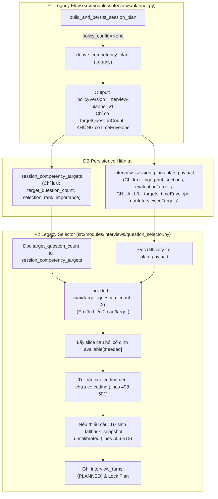
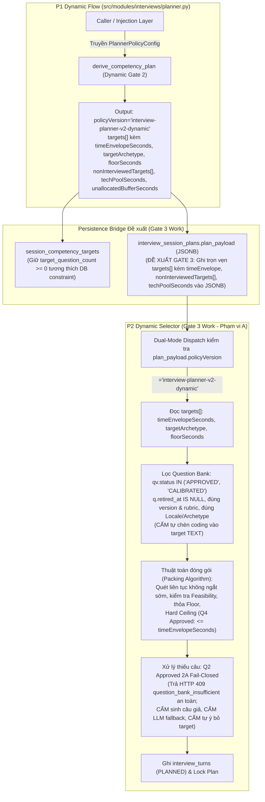

# BÁO CÁO AUDIT VÀ ĐỀ XUẤT HỢP ĐỒNG TÍCH HỢP P1–P2
**Tài liệu Kiểm định Kiến trúc, Đối chiếu Mismatch và Đề xuất Hợp đồng Dữ liệu giữa P1 Planner và P2 Question Selector**  
*Dự án: INTERVIA — Interview Chat Core*  
*Repository: `interview-prep-core`*  
*Nhánh: `feat/interview-text-runtime`*  
*Ngày lập: 28/09/2026*  
*Trạng thái: Báo cáo Kiểm định Kỹ thuật (Technical Audit & Contract Specification) — Đặc tả Kỹ thuật Chuẩn bị Gate 3*  

---

> [!IMPORTANT]
> **Tuyên bố Phạm vi & Nguyên tắc Thực thi**:
> - **Chỉ rà soát và cập nhật tài liệu đặc tả**: Lượt thực hiện này không thay đổi mã nguồn, test suite, schema cơ sở dữ liệu, file migration hay dữ liệu Question Bank.
> - **Cập nhật theo phê duyệt chính thức từ Product Owner (28/09/2026)**: Product Owner đã chính thức phê duyệt Quyết định 2 (**2A Fail-Closed**), Quyết định 4 (**Lựa chọn A: Hard Ceiling**), và Phạm vi triển khai Gate 3 (**Phạm vi A — P2 Module Testing**). Các phương án Soft Ceiling B/C và Deficit 2B không được chọn.
> - **Quyền quyết định kỹ thuật của Lead Architect**: Thuật toán feasibility & packing (giữa Lookahead và Two-Phase Subset Search), objective function so sánh tập hợp và cơ chế tie-break thuộc thẩm quyền của Lead Architect và tiếp tục ở trạng thái chờ phê duyệt (Pending Lead Architect approval).
> - **Ranh giới an toàn Production**: Tuyệt đối chưa kích hoạt Dynamic Planner trên production. Toàn bộ session production tiếp tục chạy trên nhánh legacy (`policy_config=None`, `interview-planner-v1`).

---

## 1. TỔNG QUAN ĐIỀU HÀNH & CÁC BLOCKER TRƯỚC TÍCH HỢP

### 1.1. Bối cảnh
Ở Gate 2, module P1 Planner đã được tái cấu trúc thành công theo đặc tả `docs/INTERVIEW_P1_GATE2_SPEC_AND_ACCEPTANCE_CASES.md`. Thuật toán động mới đã có khả năng tính toán ngân sách thời gian thực tế (`techPoolSeconds`), phân bổ phong bì thời gian nguyên giây (`timeEnvelopeSeconds`), cấp mức sàn thời lượng (`floorSeconds` $\ge 180$s cho `TEXT`, $\ge 360$s cho `CODING`), chia thặng dư theo Hamilton–Hare, và tiền lọc $100\%$ target `not_applicable` sang `nonInterviewedTargets`.

Tuy nhiên, module P2 Question Selector (`src/modules/interviews/question_selector.py`) hiện tại vẫn chạy trên logic chọn số lượng câu hỏi tĩnh của phiên bản cũ. Sự lệch pha giữa output của P1 và cách tiêu thụ của P2 là rào cản kỹ thuật trực tiếp cần được giải quyết ở Gate 3.

### 1.2. Các Blocker Chính Trước Tích Hợp

> **Cập nhật trạng thái (rà soát lại toàn bộ luồng interview).** Bốn blocker bên
> dưới giữ nguyên mô tả gốc để làm hồ sơ. Trạng thái hiện tại của mã nguồn:
>
> | Blocker | Trạng thái | Ghi chú |
> |---|---|---|
> | 1 — sàn `max(targetQuestionCount, 2)` | ✅ Đã gỡ | P2 freeze đúng `targetQuestionCount`; tổng câu kỹ thuật `<= questionBudget` (có thể nhỏ hơn khi ít target vì trần 3 câu/target). Regression: `test_legacy_branch_honours_planner_question_count`. |
> | 2 — Persistence Bridge thiếu Time Envelope | ✅ Đã sửa | `plan_payload` lưu nguyên plan, nên nhánh dynamic đọc được `targetArchetype` / `floorSeconds` / `timeEnvelopeSeconds`. Trước đó `timeEnvelopeSeconds=0` làm **mọi** target fail-closed. |
> | 3 — P2 tự tráo câu `coding` | ✅ Đã gỡ | Regression: `test_legacy_branch_does_not_force_a_coding_question`. |
> | 4 — Question Bank thiếu câu | ✅ Fail-closed **toàn phần** (PO duyệt bổ sung) | Mở rộng quyết định 2A sang cả nhánh legacy. `_fallback_snapshot` đã bị **xoá khỏi mã nguồn**. Lý do và phần bù rủi ro: xem ADR mục 1. |
>
> Hai blocker hạ tầng kiểm thử (có sẵn từ trước, không do bốn blocker trên):
>
> | Hạng mục | Trạng thái | Ghi chú |
> |---|---|---|
> | Ranh giới module — `interviews` chọc vào nội bộ `matching` | ✅ Đã gỡ | Thêm `matching/schemas.py` + `matching/facade.py` ở gốc module theo đúng quy ước sẵn có của `user_cvs` / `job_descriptions`. `planning/planner.py` và `planning/plan_structure.py` nay import qua bề mặt công khai; `TaxonomyRef` lấy từ `user_cvs.schemas` vì đó mới là chủ sở hữu thật. |
> | Ranh giới module — `matching` chọc vào nội bộ `user_cvs` | ✅ Đã gỡ (PO duyệt) | `user_cvs/schemas.py` bổ sung `LanguageClaim` + `SkillClaim`; ba file `matching/clarifications/{answer_evidence,models,rescore}.py` import qua bề mặt công khai. Đã kiểm mọi class re-export là **cùng một object** (`is`), nên không có pydantic model nào bị bọc lại. |
> | `test_planner_db_integration` không chạy được | ✅ Đã sửa | `InterviewAgent.execute` truyền `durability="sync"` kể cả khi `get_interview_checkpointer()` trả `None`, làm LangGraph vỡ trong `AsyncPregelLoop`. Nay chỉ truyền khi có checkpointer. Test **PASS** trên PostgreSQL thật (`RUN_DB_INTEGRATION_TESTS=1`) — P1 lần đầu có coverage mức DB. Không phải lỗi production: caller duy nhất của `.execute()` đi qua FastAPI lifespan, nơi checkpointer luôn được set. |
>
> `tests/app/test_architecture.py` nay **xanh toàn phần** — 0 vi phạm ranh giới
> module trên toàn `src/modules`.
>
> **Gate backend: 758 passed / 1 failed / 2 skipped** — chạy trọn bộ trên host
> bằng `.venv` của dự án, với `RUN_DB_INTEGRATION_TESTS=1`.
>
> Fail duy nhất: `tests/modules/matching/test_evaluation_runner.py::test_production_evaluation_runs_the_facade_for_all_golden_cases`
> — đã đối chiếu baseline (`git stash`), fail y hệt khi chưa có thay đổi nào của
> phiên này. Thuộc `matching`.
>
> **Một test flaky, chưa khoanh được:**
> `tests/modules/matching/test_targeted_reparse.py::test_targeted_reparse_does_not_recover_generic_requirement_words`
> fail ở 1 trong 2 lần chạy full suite, nhưng pass 8/8 khi chạy riêng (cả khi
> ParadeDB truy cập được lẫn khi ép fallback in-memory). Phụ thuộc thứ tự chạy;
> chưa tái hiện được ổn định. Thuộc `matching`.
>
> **Điểm cần nhớ về môi trường:** PostgreSQL **native** (`postgresql-x64-18`)
> chiếm IPv4 `0.0.0.0:5432` trong khi Docker chỉ bind được IPv6 `[::]:5432`.
> Hai bên không báo lỗi khi khởi động, nhưng `localhost` phân giải IPv4 trước
> nên mọi kết nối từ host **trúng nhầm native** — đó là nguyên nhân thật của
> `extension "vector" is not available`. Đã stop service và chuyển `StartupType`
> sang `Manual`; Docker nay bind dual-stack và chiếm cả hai.
>
> Lưu ý chạy test: phải dùng `.venv` của dự án (`.venv/Scripts/python.exe -m pytest`).
> Python global trên máy thiếu `aio-pika` và `celery` nên 7 module test không
> collect được — `.venv` thì có đủ.
>
> Phần bù rủi ro cho Blocker 4: seed Question Bank mở rộng từ 4 lên **25
> concept / 93 câu** (backend, frontend, cloud-devops, mobile, game, cùng các
> nền tảng dùng chung như SQL/Git/HTTP/JSON) và bổ sung mapping `TARGET_ROLE`
> cho toàn bộ career code, nên nhánh career-classification fallback của P1
> không còn chết chắc ở P2. Đo trên 103 file JD golden: **0 concept bị hở**,
> được khoá bằng test dev-gate chống hồi quy.

1. **Blocker 1: P2 ép cứng số lượng câu hỏi tối thiểu (`needed = max(targetQuestionCount, 2)`)**:
   - *Vị trí mã nguồn*: `src/modules/interviews/question_selector.py:494`.
   - *Hậu quả*: Bất kể P1 phân bổ phong bì thời gian bao nhiêu (kể cả khi P1 chỉ định mức sàn 180s cho 1 câu `TEXT`), P2 luôn ép chọn tối thiểu 2 câu hỏi cho mỗi target.
   - *Phân tích định lượng kịch bản giả định (Analytical Hypothetical Scenario — Không phải Telemetry)*:
     - Giả định phiên phỏng vấn có thời lượng tổng $T_{\text{session}} = 25$ phút ($1.500$ giây) với 4 competency targets được chọn.
     - Dưới logic hiện tại của P2, hệ thống sẽ chọn $4 \times 2 = 8$ câu hỏi kỹ thuật.
     - **Tính riêng phần câu hỏi kỹ thuật**: Với giả định thời gian trả lời trung bình mỗi câu từ $180$s đến $240$s:
       - Cận dưới: $8 \times 180\text{s} = 1.440$ giây (chiếm $96\%$ thời lượng toàn phiên).
       - Cận trên: $8 \times 240\text{s} = 1.920$ giây (vượt $128\%$ thời lượng toàn phiên).
       - (Con số $1.680$ giây chỉ là một điểm trung bình giả định $8 \times 210$s, không phải mức tối đa).
     - **Tính các lượt cố định ngoài kỹ thuật (theo mã nguồn P2 hiện tại)**:
       - Turn 0 (`WARM_UP`): soft 120s, hard 180s.
       - Turn 1 (`VALIDATE` CV): soft 180s, hard 240s.
       - Turn STAR Behavioral: soft 180s, hard 240s.
       - Tổng thời lượng giả định cho các lượt cố định: $120 + 180 + 180 = 480$ giây (soft) đến $180 + 240 + 240 = 660$ giây (hard).
     - **Tổng thời lượng giả định toàn phiên**: Từ $1.440 + 480 = 1.920$ giây ($32$ phút) đến $1.920 + 660 = 2.580$ giây ($43$ phút), chưa tính thời gian sinh runtime probes hay lượt closing.
   - *Làm rõ các khái niệm timeout/cutoff theo đúng mã nguồn runtime*:
     - **Timeout một lượt (Single-turn hard timeout)**: Được quy định bởi `hard_answer_seconds` gắn với từng câu hỏi trong Question Bank (`src/modules/question_bank/models.py:71`) để ngắt lượt trả lời nếu ứng viên nói quá thời gian của riêng câu đó.
     - **Dừng cấp câu hỏi mới và đóng phiên an toàn (Ngưỡng 90 giây)**: Theo `src/modules/interviews/core/interview_engine.py:871-874`, khi thời gian còn lại của phiên $\le 90$ giây và không ở stage `WARM_UP`, hàm `_get_next_stage_and_question` trả về `(InterviewStage.CLOSED, None)` để dừng cấp câu hỏi mới và chuyển phiên sang giai đoạn kết thúc an toàn. Tương tự tại line 525, stage `CLOSING` hoàn tất phiên với mã lý do chuẩn `SessionExitReason.NORMAL_COMPLETION` khi thời gian còn lại $\le 90$ giây hoặc ứng viên không còn câu hỏi nào khác.
     - **Hard Timeout toàn phiên khi nhận câu trả lời (Ngưỡng 30 giây)**: Theo `src/modules/interviews/core/interview_engine.py:248-264`, khi ứng viên nộp câu trả lời (`submit_turn_answer`), nếu thời gian còn lại của phiên $\le 30$ giây và chưa ở stage `CLOSING`, hệ thống chủ động ngắt phiên ngay lập tức với mã lý do chính thức `SessionExitReason.HARD_TIMEOUT`. Đây là hard timeout toàn phiên, tuyệt đối không gọi là emergency/pacing cutoff.
     - **Nhãn `end_reason` cho pacing cutoff (quyết định mới, ghi nhận tại đây)**: khi engine dừng phiên ở ngưỡng 90 giây mà hàng đợi frozen vẫn còn lượt chưa trả lời, runtime **không** đóng phiên là `COMPLETED` nữa (trước đây ném 409 `INVALID_SESSION_COMPLETION` sau khi đã commit tin nhắn ứng viên, làm ứng viên kẹt trong phòng). Phiên được đóng với `end_reason` phản ánh đúng nguyên nhân: `HARD_TIMEOUT` khi `remaining_time <= closing_reserve + behavioral_reserve`, `TECHNICAL_FAILURE` khi dừng sớm vì lý do khác. Như vậy `HARD_TIMEOUT` hiện bao phủ **cả** ngưỡng 30 giây lẫn pacing cutoff 90 giây — mở rộng so với định nghĩa hẹp ở các gạch đầu dòng phía trên.
   - **Giới hạn thời lượng phiên (Session duration limit)**: Giới hạn tổng thể $T_{\text{session}} = \text{duration\_minutes} \times 60$. Nguy cơ của kịch bản trên là thời lượng cần thiết vượt xa giới hạn phiên, dẫn tới việc ứng viên chưa kịp đi hết danh sách câu hỏi đã chạm ngưỡng 90 giây (dừng cấp câu mới) hoặc ngưỡng 30 giây (`HARD_TIMEOUT`).

2. **Blocker 2: Persistence Bridge hiện tại chưa lưu trữ các trường Time Envelope**:
   - *Vị trí mã nguồn*: `src/modules/interviews/planner.py:948-990`, `src/modules/interviews/question_selector.py:451-475`.
   - *Hậu quả*: Hàm `build_and_persist_session_plan` hiện tại chỉ ghi vào bảng `session_competency_targets` các cột cũ (`target_question_count`, `importance`, `selection_rank`), và chỉ ghi metadata tối thiểu vào `plan_payload` (`policyVersion`, `fingerprint`, `questionBudget`, `difficulty`, `sections`, `evaluationTargets`). Các trường động mới của P1 (`timeEnvelopeSeconds`, `targetArchetype`, `floorSeconds`, `estimatedQuestionsRange`, `techPoolSeconds`, `unallocatedBufferSeconds`, `nonInterviewedTargets`) **chưa được lưu trữ vào DB hay plan_payload**. Do đó, P2 khi truy vấn DB hoàn toàn không có thông tin về Time Envelope.

3. **Blocker 3: P2 tự ý tráo câu hỏi Coding vào Target lý thuyết TEXT**:
   - *Vị trí mã nguồn*: `src/modules/interviews/question_selector.py:498-501`.
   - *Hậu quả*: P2 đang có đoạn mã: nếu `needed >= 2` và danh sách chọn chưa có câu `coding`, P2 sẽ tự tìm 1 câu `coding` trong kho và thay thế vào danh sách câu chọn. Việc này phá vỡ quyết định hạ cấp sang `TEXT` của P1 (Decision 5A) và làm nổ tung mức sàn thời lượng của target.

4. **Blocker 4: Kho câu hỏi Question Bank có thể thiếu câu đạt chuẩn (Đã chốt chính sách Q2: 2A Fail-Closed)**:
   - *Vị trí mã nguồn*: `src/modules/interviews/question_selector.py:506-512`.
   - *Hậu quả*: Code P2 hiện tại đang tự sinh prompt tạm không qua kiểm duyệt (`_fallback_snapshot`) khi thiếu câu trong kho.
   - *Chính sách đã phê duyệt & Ràng buộc thẩm quyền*:
     - **Chính sách Deficit đã duyệt (Q2: 2A Fail-Closed — Product Approved 28/09/2026)**: P2 Dynamic chỉ sử dụng câu hỏi đạt chuẩn phê duyệt/calibration (`qv.status IN ('APPROVED', 'CALIBRATED')` theo hằng số `_ELIGIBLE_STATUSES` tại `src/modules/interviews/question_selector.py:23, 144`, `q.retired_at IS NULL`, trỏ đúng `current_approved_version_id`, và có rubric chấm điểm hợp lệ qua bảng `question_version_rubrics`). Nếu bất kỳ target bắt buộc nào không có tập câu đạt đúng archetype và floor của target, P2 không đóng băng queue thiếu hụt và không mở phiên; trả về lỗi `QuestionUnavailableError` với HTTP 409 và mã lỗi ổn định `question_bank_insufficient`. Response chỉ ra target/concept bị thiếu ở dạng an toàn, tuyệt đối không trả nội dung nội bộ của rubric hoặc câu hỏi không được phép hiển thị.
     - **Đối với nhánh dynamic**: P2 là module thực thi kế hoạch cấp thấp, tuyệt đối **không tự ý loại bỏ target** (chỉ P1 mới có thẩm quyền omit target ở khâu lập kế hoạch), **không tự ý tái phân bổ ngân sách**, **không sinh câu hỏi giả lập** (synthetic prompt), **không gọi LLM fallback ad-hoc** tại runtime, và **không chỉnh sửa dữ liệu hay schema của Question Bank**.
     - **Đối với nhánh legacy**: Hành vi fallback cũ (`_fallback_snapshot`) tiếp tục được duy trì nguyên vẹn để bảo đảm tính tương thích ngược cho các phiên legacy hiện hành cho tới khi có quyết định rollout/loại bỏ riêng. Tuyệt đối không tuyên bố toàn hệ thống đã ngừng fallback. Phương án 2B không được chọn.

---

## 2. SƠ ĐỒ LUỒNG DỮ LIỆU: HIỆN TRẠNG VÀ ĐỀ XUẤT GATE 3

Để phân định rõ ràng giữa những gì đang chạy trong mã nguồn hiện tại và những gì được đề xuất triển khai ở Gate 3, luồng dữ liệu được tách thành hai nhánh:

### 2.1. Luồng Hiện Trạng (Current State in Code)



### 2.2. Luồng Đề Xuất Cho Gate 3 (Proposed Gate 3 Flow)



---

## 3. BẢNG CONTRACT DỮ LIỆU VÀ XÁC MINH PERSISTENCE THỰC TẾ

### 3.1. Xác minh Thực tế Đường đi Dữ liệu (Persistence Trace)
Lần theo mã nguồn thực tế:
1. `derive_competency_plan` (`src/modules/interviews/planner.py:840-865`): Trả về dict đầy đủ theo output contract của P1 Gate 2 (chứa `targets`, `nonInterviewedTargets`, `techPoolSeconds`, `unallocatedBufferSeconds`, v.v.).
2. `build_and_persist_session_plan` (`src/modules/interviews/planner.py:875-995`):
   - Gọi `derive_competency_plan` (hiện truyền `policy_config=None` nên chạy luồng legacy).
   - Ghi vào bảng `session_competency_targets` (`lines 948-968`): Chỉ insert các cột: `id`, `plan_id`, `selection_rank`, `taxonomy_version`, `concept_id`, `label`, `importance`, `target_question_count`, `rationale`.
   - Ghi vào bảng `interview_session_plans.plan_payload` (`lines 970-991`): Chỉ insert JSON gồm: `policyVersion`, `fingerprint`, `questionBudget`, `difficulty`, `sections`, `evaluationTargets`.
   - **Kết luận**: Các trường `timeEnvelopeSeconds`, `targetArchetype`, `floorSeconds`, `estimatedQuestionsRange`, `techPoolSeconds`, `unallocatedBufferSeconds`, `nonInterviewedTargets` **CHỈ CÓ TRONG OUTPUT CỦA PLANNER, CHƯA ĐƯỢC PERSIST XUỐNG BẤT KỲ ĐÂU TRONG DB HIỆN TẠI**.
3. `select_and_freeze_questions` (`src/modules/interviews/question_selector.py:451-475`):
   - Truy vấn `SELECT ... FROM session_competency_targets WHERE plan_id = :plan_id`.
   - Đọc `plan_payload` chỉ để lấy `difficulty`.
   - Hoàn toàn không nhận được `timeEnvelopeSeconds`.

### 3.2. Bảng Đối chiếu Trạng thái Từng Trường

| Tên trường (Field Name) | Kiểu dữ liệu | Trạng thái Persistence Hiện tại | Nguồn chuẩn Đề xuất cho Gate 3 | Ngữ nghĩa nghiệp vụ | Consumer & Vị trí trong Code |
| :--- | :--- | :--- | :--- | :--- | :--- |
| `selectionRank` | `int` | **Được persist hiện tại** (Cột `session_competency_targets.selection_rank`) | Cả hai (`plan_payload.targets` và DB column) | Thứ tự ưu tiên của target trong agenda phỏng vấn. | P2 Selector (`src/modules/interviews/question_selector.py:458`), UI. |
| `taxonomyVersion` | `str` | **Được persist hiện tại** (Cột `session_competency_targets.taxonomy_version`) | Cả hai (`plan_payload.targets` và DB column) | Định danh phiên bản taxonomy năng lực. | P2 query Question Bank concepts (`src/modules/interviews/question_selector.py:467`). |
| `conceptId` | `str` | **Được persist hiện tại** (Cột `session_competency_targets.concept_id`) | Cả hai (`plan_payload.targets` và DB column) | Mã định danh khái niệm năng lực chuẩn hóa. | P2 query Question Bank concepts (`src/modules/interviews/question_selector.py:468`). |
| `label` | `str` | **Được persist hiện tại** (Cột `session_competency_targets.label`) | Cả hai (`plan_payload.targets` và DB column) | Nhãn hiển thị của năng lực. | UI, Chat Runtime message prompt. |
| `importance` | `float` | **Được persist hiện tại** (Cột `session_competency_targets.importance`) | Cả hai (`plan_payload.targets` và DB column) | Trọng số phân bổ chuẩn hóa ($0 \le \text{importance} \le 1$). | P4 Evaluation tính điểm trọng số. |
| `targetQuestionCount` | `int` | **Được persist hiện tại** (Cột `session_competency_targets.target_question_count`) | Cột DB (Chỉ giữ vai trò tương thích DB) | Số lượng câu hỏi tương thích DB check constraint $\ge 0$. | P2 legacy (`src/modules/interviews/question_selector.py:494`). **Không dùng làm quyền quyết định số câu ở Gate 3**. |
| `rationale` | `dict` | **Được persist hiện tại** (Cột `session_competency_targets.rationale`) | Cả hai (`plan_payload.targets` và DB column) | Căn cứ tuyển dụng (source, priorities, matchStatuses, JD refs). | P2 allowed purposes mapping, P4 Evidence Audit. |
| `targetArchetype` | `str` (`TEXT` \| `CODING`) | **Chưa được persist** (Chỉ có trong output planner) | `plan_payload.targets[].targetArchetype` | Hình thức kiểm tra bắt buộc P1 giao cho P2. | P2 Gate 3: lọc `question_type` trong Question Bank. |
| `timeEnvelopeSeconds` | `int` | **Chưa được persist** (Chỉ có trong output planner) | `plan_payload.targets[].timeEnvelopeSeconds` | Tổng ngân sách thời gian tối đa (giây) P2 được phép dùng cho target. | P2 Gate 3: trần thời gian đóng gói câu hỏi. |
| `floorSeconds` | `int` | **Chưa được persist** (Chỉ có trong output planner) | `plan_payload.targets[].floorSeconds` | Mức sàn thời lượng tối thiểu bắt buộc của target (180s hoặc 360s). | P2 Gate 3: kiểm tra điều kiện khả thi khi chọn câu. |
| `estimatedQuestionsRange` | `list[int]` `[min, max]` | **Chưa được persist** (Chỉ có trong output planner) | `plan_payload.targets[].estimatedQuestionsRange` | Dải số lượng câu hỏi ước tính của P1 để tham khảo. | P2 Gate 3, UI hiển thị tiến độ. |
| `techPoolSeconds` | `int` | **Chưa được persist** (Chỉ có trong output planner) | `plan_payload.techPoolSeconds` | Quỹ thời gian kỹ thuật chuyên môn khả dụng của phiên. | P2 Gate 3: trần ngân sách kỹ thuật toàn phiên. |
| `unallocatedBufferSeconds` | `int` | **Chưa được persist** (Chỉ có trong output planner) | `plan_payload.unallocatedBufferSeconds` | Thời gian kỹ thuật chưa phân bổ (buffer an toàn). | Runtime buffer, Audit trail. |
| `nonInterviewedTargets` | `list[dict]` | **Chưa được persist** (Chỉ có trong output planner) | `plan_payload.nonInterviewedTargets` | Danh sách targets bị loại khỏi agenda kèm `omissionReason`. | P4 Evaluation (không phạt điểm), Audit trail. |
| `evaluationTargets` | `list[dict]` | **Được persist hiện tại** (Trong `plan_payload.evaluationTargets`) | `plan_payload.evaluationTargets` | Toàn bộ requirements từ JD kèm trạng thái thẩm định. | P4 Evaluation đối soát độ bao phủ JD. |

---

## 4. CHI TIẾT CÁC MISMATCH VÀ ĐỀ XUẤT GIẢI PHÁP CHO GATE 3

### 4.1. Mismatch Về Quyền Quyết Định Số Lượng Câu Hỏi
- **Hiện trạng mã nguồn**:
  Tại `src/modules/interviews/question_selector.py:494`:
  ```python
  needed = max(target["targetQuestionCount"], 2)
  selected = available[:needed]
  ```
  P2 tự ý nâng số câu hỏi tối thiểu lên 2 bất kể Time Envelope.
- **Đề xuất giải pháp cho Gate 3**:
  P2 phải đọc `timeEnvelopeSeconds` từ `plan_payload.targets`. Số câu hỏi chọn được phải phụ thuộc vào việc đóng gói thời gian, cho phép chọn đúng 1 câu hỏi nếu thời lượng câu đó thỏa mãn sàn và ngân sách.

---

### 4.2. Mismatch Về Phân Định Chi Phí Thời Lượng (Duration Cost Semantics)
- **Xác minh mã nguồn và Database Model**:
  Trong `src/modules/question_bank/models.py:69-71`:
  - `thinking_seconds` (int, default=0): Thời gian suy nghĩ đề bài trước khi trả lời.
  - `soft_answer_seconds` (int, non-nullable): Thời lượng trả lời khuyến nghị chuẩn để đạt yêu cầu của rubric.
  - `hard_answer_seconds` (int, non-nullable): Trần thời gian kỹ thuật tối đa của lượt hỏi (timeout guardrail).
- **Phân tách khái niệm rõ ràng**:
  1. *Estimated Selection Cost (Chi phí lựa chọn tĩnh tại P2)*: Là giá trị ước tính dùng trong thuật toán đóng gói của P2 để chọn câu.
  2. *Hard Timeout (Trần kỹ thuật)*: Là mốc ngắt lượt bắt buộc nếu ứng viên nói quá thời gian của riêng câu đó (`hard_answer_seconds`).
  3. *Runtime Wall-Clock (Thời gian thực tế)*: Phụ thuộc vào tốc độ tương tác thực tế của ứng viên trong toàn phiên.
- **Ràng buộc quan trọng**:
  - Không được giả định phần chênh lệch giữa `hard_answer_seconds` và `soft_answer_seconds` sẽ được "hấp thụ bởi `probePoolSeconds`". Quỹ probe pool ($T_{\text{probe\_pool}}$) theo đặc tả gốc chỉ phục vụ các lượt probe đào sâu tại runtime; việc gán thêm trách nhiệm hấp thụ độ trễ câu chính vào probe pool là giả định chưa có căn cứ và có nguy cơ làm cạn kiệt quỹ probe.
- **Đề xuất kỹ thuật chờ kiểm chứng qua Telemetry (Proposal - Not Policy)**:
  - Tạm thời đề xuất chi phí lựa chọn tĩnh của một câu hỏi $q$:
    $$\text{estimated\_cost}(q) = \text{thinking\_seconds}(q) + \text{soft\_answer\_seconds}(q)$$
  - Công thức này là giả định kỹ thuật đề xuất cho Gate 3, cần được kiểm chứng và tinh chỉnh khi có dữ liệu telemetry thực tế từ runtime.

---

### 4.3. Rà Soát Thuật Toán Đóng Gói Câu Hỏi (Packing Algorithm)

#### 4.3.1. Nguồn Dữ liệu Xếp hạng Ứng viên Câu hỏi (Code-Backed Candidate Ranking)
Lần theo mã nguồn thực tế tại `src/modules/interviews/question_selector.py:85-112`, danh sách câu hỏi ứng viên được xếp hạng theo tuple các tiêu chí đã có trong code:
1. `_locale_rank(candidate.canonical_locale, locale)` (0: khớp tuyệt đối, 1: cùng ngôn ngữ, 10: khác ngôn ngữ, 99: loại bỏ).
2. `_difficulty_distance(candidate.difficulty_band, difficulty)` (khoảng cách độ khó so với target level).
3. `purpose_rank` (Mapping purpose: `PRIMARY_COMPETENCY` = 0, `TARGET_SKILL` = 1, `TARGET_ROLE` = 2).
4. `-candidate.relevance` (Trọng số liên quan từ bảng `question_version_taxonomy_concepts.relevance`).
5. `tiebreaker` (`hashlib.md5(f"{salt}:{candidate.question_version_id}".encode("utf-8")).hexdigest()`).
6. `candidate.version` và `candidate.question_version_id` (đảm bảo tính xác định tuyệt đối).

> [!WARNING]
> **Không có trường `quality_score` trong mã nguồn hay schema hiện tại**: Mọi ý tưởng về việc sắp xếp theo `quality_score` chỉ là **câu hỏi thiết kế chưa chốt (Unresolved Design Question)**, không có cơ sở mã nguồn hiện hữu. Gate 3 chỉ sử dụng các trường đã có trong code nêu trên.

#### 4.3.2. Giới Hạn Của Thuật Toán Greedy Đơn Giản & Đề Xuất Giải Pháp Đạt Sàn (Floor Feasibility)
- **Ghi nhận Giới hạn Tính toán (Greedy Suboptimality / Floor Feasibility Failure)**:
  Thuật toán Greedy thuần túy (chọn theo thứ tự xếp hạng relevance giảm dần) có thể **thất bại không tìm được tập câu đạt mức sàn `floorSeconds` dù tập câu hợp lệ tồn tại trong kho**.
  *Ví dụ minh chứng*:
  - Target có ngân sách `timeEnvelopeSeconds = 360`s và sàn `floorSeconds = 360`s.
  - Trong Question Bank có:
    - Câu $A$ (relevance cao nhất): chi phí $300$s.
    - Câu $B$ (relevance thấp hơn): chi phí $180$s.
    - Câu $C$ (relevance thấp hơn): chi phí $180$s.
  - Nếu duyệt Greedy thuần túy: Hệ thống chọn câu $A$ ($300$s). Ngân sách còn lại $360 - 300 = 60$s. Cả câu $B$ ($180$s) và $C$ ($180$s) đều không vừa $60$s. Tổng thời lượng chỉ đạt $300$s $< 360$s sàn $\implies$ Thất bại, dù tập $\{B, C\}$ có tổng $180 + 180 = 360$s hoàn toàn vừa khít ngân sách và đạt chuẩn sàn!
- **Phân tích Rủi ro của Feasibility Pre-check Đơn lẻ**:
  Một bước kiểm tra khả thi đơn lẻ trước vòng lặp (Single Feasibility Pre-check) là **hoàn toàn không đủ** nếu thuật toán sau đó vẫn duyệt theo thứ tự relevance. Cụ thể trong ví dụ trên:
  - Pre-check kiểm tra kho và xác nhận tồn tại tập hợp lệ $\{B, C\}$ $\implies$ trả về `True`.
  - Nhưng nếu sau đó thuật toán tiếp tục greedy bốc câu $A$ ($300$s) do relevance cao nhất, việc chọn câu $A$ ngay lập tức triệt tiêu khả năng chọn $\{B, C\}$ và khiến ngân sách còn lại ($60$s) không thể đạt sàn $360$s.
- **Yêu cầu Hành vi đã được Product Owner Phê Duyệt (Product Approved 28/09/2026)**:
  1. P2 **bắt buộc phải chọn được tập câu đạt sàn `floorSeconds`** nếu trong candidate pool tồn tại ít nhất một tập câu hợp lệ đồng thời thỏa mãn mức sàn và Hard Ceiling (`<= timeEnvelopeSeconds`).
  2. Với test fixture ngân sách $360$s, sàn $360$s và chi phí các câu $A=300$s, $B=180$s, $C=180$s: Thuật toán **bắt buộc phải chọn tập $\{B, C\}$** (tổng $360$s); tuyệt đối không được kết thúc chỉ với câu $A=300$s (dưới sàn).
  3. Nếu không tồn tại bất kỳ tập câu nào khả thi thỏa mãn đồng thời cả sàn và trần, hệ thống chuyển sang xử lý theo **Q2 2A Fail-Closed** (từ chối mở phiên, trả HTTP 409).
- **Quyết định Kỹ thuật Thuộc Thẩm quyền Lead Architect (Pending Lead Architect Approval)**:
  Lead Architect được giao thẩm quyền xem xét và chọn giữa hai phương án kỹ thuật:
  1. *Phương án A: Feasibility-Preserving Lookahead Selection (Pruning theo từng bước duyệt)*:
     - Duyệt danh sách candidate đã sắp xếp. Khi xét ứng viên $q$, chỉ kết nạp $q$ nếu tập các ứng viên còn lại vẫn bảo đảm khả năng tìm được ít nhất một tổ hợp con đạt mức sàn $\text{floorSeconds} - \text{cost}(q)$ trong ngân sách còn lại $\text{timeEnvelopeSeconds} - \sum \text{cost} - \text{cost}(q)$. Nếu mất tính khả thi đạt sàn, $q$ bị bỏ qua.
     - Ưu điểm: Bám sát thứ tự ưu tiên của từng câu hỏi đơn lẻ; cấu trúc duyệt tuyến tính.
     - Nhược điểm: Phức tạp trong cài đặt nhánh con kiểm tra feasibility tại mỗi bước kết nạp.
  2. *Phương án B: Two-Phase Subset Search (Tìm tập khả thi trước, rồi xếp hạng)*:
     - Pha 1: Tìm tất cả các tập con câu hỏi $S \subseteq \text{Candidates}$ thỏa mãn đồng thời $\text{floorSeconds} \le \sum_{q \in S} \text{estimated\_cost}(q) \le \text{timeEnvelopeSeconds}$.
     - Pha 2: Trong các tập con khả thi, áp dụng tiêu chí xếp hạng tập hợp để chọn ra tập tối ưu nhất.
     - Ưu điểm: Phân tách rạch ròi bài toán feasibility và ranking; bảo đảm 100% không rớt sàn nếu có tập hợp lệ.
     - Nhược điểm: Không gian tìm kiếm tổ hợp tăng theo số lượng candidate ($2^N$), đòi hỏi kỹ thuật giới hạn nhánh (branch-and-bound / pruning).
- **Các Hạng mục Lead Architect Cần Định Nghĩa & Phê Duyệt**:
  1. *Cách áp dụng ranking tuple hiện có ở cấp tập câu*: Mã nguồn hiện có tuple đa tiêu chí (`_locale_rank`, `_difficulty_distance`, `purpose_rank`, `-candidate.relevance`, `tiebreaker`). Lead Architect cần chỉ rõ cách áp dụng tuple này khi so sánh giữa hai tập hợp câu hỏi (so sánh vector từ điển hay vô hướng hóa thành điểm số tổng hợp).
  2. *Hàm mục tiêu / Trật tự ưu tiên khi so sánh các tập khả thi*: Tiêu chí ưu tiên khi so sánh giữa các tập (ví dụ: tối đa hóa tổng relevance $\sum \text{relevance}$, ưu tiên độ khớp difficulty, hay ưu tiên thứ tự từ điển candidate cao nhất).
  3. *Cơ chế tie-break ổn định (Deterministic Tie-Break)*: Quy tắc phá vỡ thế hòa dứt điểm giữa hai tập câu hỏi có chất lượng ngang nhau dựa trên session salt và `question_version_id`, bảo đảm không phụ thuộc vào thứ tự trả về bất định của SQL query.
  4. *Giới hạn chi phí tính toán & Benchmark thực tế*: Thiết lập cơ chế kiểm soát chi phí tính toán và thực hiện benchmark đo kiểm với kích thước candidate pool thực tế trên cơ sở dữ liệu Question Bank.
  5. *Quy tắc sắp xếp thứ tự turns nội bộ (Intra-subset Turn Ordering)*: Lead Architect đã hoàn tất đánh giá và chốt **Phương án 1 (Sắp xếp theo `_candidate_rank` tăng dần)** để xác định thứ tự `turn_index = 0, 1, ...`, bảo đảm ưu tiên giá trị sư phạm và độc lập 100% với thứ tự trả về bất định của database row trong SQL query.
- **Ranh giới Quyết định**: Việc lựa chọn giữa Phương án A và Phương án B, định nghĩa hàm mục tiêu $R(S)$, tie-break MD5 và thứ tự turns nội bộ đã được Lead Architect hoàn tất thiết kế trong [`docs/INTERVIEW_P2_PACKING_ALGORITHM_ADR.md`](INTERVIEW_P2_PACKING_ALGORITHM_ADR.md) và hiện đang ở trạng thái **Pending Formal Lead Architect Sign-off** (ADR giữ `PROPOSED` chờ xác nhận chính thức).

#### 4.3.3. Các Điều Kiện Đóng Gói Cốt Lõi
1. **Quét đóng gói không ngắt sớm (Continuous Scan)**:
   Nếu một ứng viên câu hỏi có thời lượng không vừa với phần ngân sách còn lại, thuật toán **không được break toàn bộ vòng lặp**, mà phải tiếp tục duyệt các câu hỏi phía sau xem có câu nào vừa với ngân sách còn lại hay không.
2. **Kiểm tra Điều kiện Mức Sàn (Floor Condition)**:
   Sau khi quét/đóng gói, tập câu hỏi được chọn $\text{selected}$ phải thỏa mãn:
   $$\sum_{q \in \text{selected}} \text{estimated\_cost}(q) \ge \text{floorSeconds}$$
   (Trong đó `floorSeconds` $\ge 180$s cho `TEXT`, $\ge 360$s cho `CODING`).
3. **Kiểm soát Trần Ngân sách (Ceiling Policy - Decision 4: Hard Ceiling APPROVED)**:
   - **Quyết định Product đã phê duyệt (Product Approved 28/09/2026)**: **Lựa chọn A — Hard Ceiling (Trần cứng tuyệt đối)**.
   - **Quy tắc thực thi**: Với mỗi target, tổng chi phí ước tính của các câu hỏi được chọn bắt buộc:
     $$\sum_{q \in \text{selected}} \text{estimated\_cost}(q) \le \text{timeEnvelopeSeconds}$$
   - **Ràng buộc nghiêm ngặt**:
     - Tuyệt đối **không có dung sai phần trăm** (+10% hay +15%) và **không có phụ trội giây/câu** (+30s/câu) trong Gate 3.
     - Nếu không thể thỏa mãn đồng thời mức sàn `floorSeconds` và Hard Ceiling `timeEnvelopeSeconds`, áp dụng chính sách **Q2 2A Fail-Closed**.
     - Các đề xuất Soft Ceiling (Phương án B theo % và Phương án C theo phụ trội s/câu) **KHÔNG ĐƯỢC CHỌN (REJECTED by Product)** và không được triển khai.
4. **Deterministic Tie-Break**:
   Sử dụng giá trị băm ổn định theo session salt và ID phiên bản câu hỏi (`hashlib.md5(f"{salt}:{candidate.question_version_id}".encode())`), hoàn toàn không phụ thuộc vào thứ tự trả về bất định của SQL query (`ORDER BY` thiếu unique key).

---

### 4.4. Chính Sách Khi Thiếu Câu Hỏi trong Question Bank (Decision 2: 2A Fail-Closed APPROVED)
- **Quyết định Product đã phê duyệt (Product Approved 28/09/2026)**: **Phương án 2A — Fail-Closed**.
- **Quy tắc thực thi chuẩn hóa**:
  1. *Tiêu chuẩn câu hỏi*: P2 Dynamic chỉ sử dụng các câu hỏi đạt điều kiện phê duyệt / calibration (`qv.status IN ('APPROVED', 'CALIBRATED')` theo đúng hằng số `_ELIGIBLE_STATUSES` tại `src/modules/interviews/question_selector.py:23, 144`), có `q.retired_at IS NULL`, phiên bản trỏ đúng `current_approved_version_id`, và có rubric chấm điểm hợp lệ qua bảng `question_version_rubrics`.
  2. *Quy tắc Fail-Closed*: Nếu bất kỳ target bắt buộc nào không có tập câu hỏi đạt chuẩn thỏa mãn đúng `targetArchetype` và mức sàn `floorSeconds` trong trần `timeEnvelopeSeconds`, hệ thống **tuyệt đối không đóng băng queue thiếu hụt một phần và không mở phiên phỏng vấn**.
  3. *Mã lỗi & HTTP Status*: P2 ném lỗi `QuestionUnavailableError` với mã trạng thái HTTP **409 Conflict** và mã lỗi định danh ổn định:
     ```json
     {
       "error_code": "question_bank_insufficient",
       "message": "Question Bank cannot fulfill minimum duration and archetype requirements for target competency.",
       "details": {
         "missing_targets": [
           {
             "concept_id": "core-backend-sys-design",
             "label": "System Design",
             "target_archetype": "TEXT",
             "floor_seconds": 180,
             "available_valid_seconds": 0
           }
         ]
       }
     }
     ```
  4. *An toàn thông tin (Response Safety)*: Phản hồi lỗi chỉ được phép chỉ ra định danh competency target/concept bị thiếu ở định dạng an toàn (`concept_id`, `label`, `target_archetype`, `floor_seconds`). Tuyệt đối **không trả về nội dung nội bộ của rubric**, barem chấm điểm, prompt bí mật, hoặc câu hỏi chưa được phép hiển thị ra bên ngoài.
- **Ràng buộc Thẩm quyền Nghiêm ngặt của P2**:
  P2 là module thực thi chọn câu hỏi cấp thấp theo kế hoạch do P1 phân bổ. P2 **KHÔNG CÓ THẨM QUYỀN**:
  1. *Không tự ý loại bỏ (omit) target*: Quyền quyết định loại bỏ target khỏi agenda phỏng vấn thuộc về P1 ở khâu lập kế hoạch.
  2. *Không tự ý tái phân bổ ngân sách (reallocate)*: P2 không được chuyển thời gian chưa dùng của target này sang target khác.
  3. *Không sinh câu hỏi giả lập (synthetic questions)*: Tuyệt đối cấm tạo prompt tạm uncalibrated.
  4. *Không gọi LLM fallback*: Cấm gọi LLM tại runtime để sinh câu hỏi ad-hoc thay thế Question Bank.
  5. *Không chỉnh sửa Question Bank*: Không sửa dữ liệu hay schema của Question Bank trong phạm vi Gate 2 / Gate 3.
- **Phân Biệt Rạch Ròi Hành Vi Giữa Luồng Legacy và Luồng Dynamic**:
  - *Luồng Legacy (`policyVersion = "interview-planner-v1"` hoặc thiếu)*: Tiếp tục duy trì hành vi cũ bao gồm cả `_fallback_snapshot` (`lines 506-512`) để đảm bảo không làm gãy các luồng legacy hiện hành cho tới khi có quyết định rollout/loại bỏ riêng. Tuyệt đối không tuyên bố toàn hệ thống đã ngừng fallback.
  - *Luồng Dynamic (`policyVersion = "interview-planner-v2-dynamic"`)*: Nghiêm cấm tuyệt đối việc gọi `_fallback_snapshot`. Bắt buộc thực thi 2A Fail-Closed.
- **Phương án Không được Chọn**:
  - *Phương án 2B (Đóng gói trong số câu thực tế đạt sàn)*: **KHÔNG ĐƯỢC CHỌN (REJECTED by Product)**.

---

### 4.5. Mismatch Về Archetype và Cấm Tự Chèn Coding vào Text Target
- **Hiện trạng mã nguồn**:
  Tại `src/modules/interviews/question_selector.py:498-501`:
  ```python
  if needed >= 2 and not any(c.question_type == "coding" for c in selected):
      coding_cand = next((c for c in available if c.question_type == "coding"), None)
      if coding_cand:
          selected = selected[:needed - 1] + [coding_cand]
  ```
- **Hành vi bắt buộc ở Gate 3**:
  Xóa bỏ hoàn toàn logic ép chèn coding này. P2 phải tuyệt đối tuân thủ `targetArchetype` từ P1:
  - Nếu `targetArchetype == "TEXT"`: Chỉ lọc câu hỏi có `question_type` thuộc nhóm lý thuyết / kịch bản / kiến trúc. Loại trừ hoàn toàn `coding`.
  - Nếu `targetArchetype == "CODING"`: Chỉ lọc câu hỏi có `question_type == "coding"`.

---

## 5. ĐỒNG BỘ DECISION LOG & CÁC QUYẾT ĐỊNH PRODUCT CÒN MỞ

Đối chiếu chính xác với `docs/INTERVIEW_P1_GATE2_SPEC_AND_ACCEPTANCE_CASES.md` và `docs/INTERVIEW_DYNAMIC_QUESTION_BUDGET_PROPOSAL.md`, danh mục quyết định được giữ nguyên vẹn từ Q1 đến Q8:

| Mã Quyết định | Nội dung | Phạm vi | Trạng thái hiện tại | Ảnh hưởng tới Gate 3 |
| :--- | :--- | :--- | :--- | :--- |
| **Quyết định 1** | Cấu trúc lượt mở đầu & Ngân sách Onboarding (Mode 1 lượt vs Mode 2 lượt; Quota CV riêng) | P1 / Runtime | **Product-Open** (Đang tham số hóa) | P2 kế thừa cấu trúc lượt mở đầu từ session plan, không tự định nghĩa lại số lượt onboarding. |
| **Quyết định 2** | Chính sách khi thiếu câu hỏi đạt chuẩn trong Question Bank (Deficit Policy) | **P2 Selector (Gate 3)** | 🟢 **Approved by Product Owner (28/09/2026)** | **Chọn 2A Fail-Closed**: Thiếu câu đạt chuẩn/sàn ở bất kỳ target nào $\implies$ ném lỗi `QuestionUnavailableError(409 Conflict)`, mã lỗi `question_bank_insufficient`, không mở phiên, không tạo queue một phần. Response an toàn không rò rỉ rubric. Cấm omit/reallocate/synthetic/LLM fallback. Nhánh legacy giữ `_fallback_snapshot`. Phương án 2B rejected. |
| **Quyết định 3** | Giao diện hiển thị tiến độ (Stage Stepper vs Dải tương tác) | Frontend / Gate 4 | **Product-Open** | Không ảnh hưởng đến logic chọn câu của P2. |
| **Quyết định 4** | Kiểm soát trần Time Envelope (Hard Ceiling vs Soft Ceiling) | **P2 Selector (Gate 3)** | 🟢 **Approved by Product Owner (28/09/2026)** | **Chọn Lựa chọn A: Hard Ceiling**: Bắt buộc $\sum \text{estimated\_cost} \le \text{timeEnvelopeSeconds}$. Không có dung sai % hay phụ trội s/câu. Nếu không thỏa cả sàn và trần $\implies$ Q2 Fail-Closed. Phương án Soft Ceiling B và C rejected. |
| **Quyết định 5** | Coding Fallback khi thiếu ngân sách 360s (5A Downgrade sang TEXT vs 5B Omission) | P1 Planner (Gate 2) | Đã tham số hóa ở P1 | P2 chỉ việc tuân thủ `targetArchetype` kết quả từ P1. |
| **Quyết định 6** | Trần số lượt probe thực tế tại runtime (`max_runtime_probes`) | Runtime (Gate 4) | **Product-Open** | Runtime work, không thuộc phạm vi chọn câu của P2. |
| **Quyết định 7** | Priority Stop Policy khi target đầu bảng không đủ sàn (7A Stop vs 7B Skip) | P1 Planner (Gate 2) | Đã tham số hóa ở P1 | P2 chỉ nhận danh sách target đã được P1 chọn lọc. |
| **Quyết định 8** | Cơ chế quyết toán quỹ probe `T_probe_pool` tại runtime | Runtime (Gate 4) | **Product-Open** | Runtime work, không thuộc phạm vi chọn câu của P2. |

> [!NOTE]
> **Về đề xuất liên quan đến Seniority & Difficulty Distance**:
> Việc ràng buộc khoảng cách độ khó giữa Job Seniority và Question Difficulty Band là một **đề xuất kỹ thuật mới**, chưa nằm trong Decision Log gốc (Q1–Q8) và **chưa được Product phê duyệt**. Tuyệt đối không đánh số quyết định này thành Q6.

---

## 6. ĐỐI CHIẾU HẠCH TOÁN CÁC QUỸ THỜI GIAN VỚI PROPOSAL GỐC

Cần làm rõ nguồn gốc và trạng thái của các khoản quỹ ngoài kỹ thuật:

1. **Quỹ mở đầu ($T_{\text{onboarding}}$)**:
   - Công thức gốc: $T_{\text{onboarding}} = T_{\text{onboarding\_base}} + T_{\text{cv\_addon\_inclusive}}$.
   - Các giá trị (90–120s cho Mode 1; 210–270s cho Mode 2; 90–120s cho CV addon) là **dải tham số đề xuất đang chờ Product duyệt**, không phải con số cố định.
   - Hiện trạng mã nguồn Turn 0/Turn 1: Code hiện tại trong `src/modules/interviews/question_selector.py:615-667` đang gán Turn 0 (WARM_UP, soft 120s) và Turn 1 (VALIDATE, soft 180s). Đây là hành vi mã nguồn hiện hữu, chưa được chốt thành policy cuối cùng.
2. **Quỹ tình huống STAR ($T_{\text{behavioral}}$)**:
   - Tham số cấu hình tiêm vào (trong unit test Gate 2 dùng 100s hoặc 210s).
   - Mã nguồn hiện tại tạo 1 lượt STAR ở cuối danh sách câu hỏi (`src/modules/interviews/question_selector.py:752-772`).
3. **Quỹ câu hỏi đào sâu ($T_{\text{probe\_pool}}$)**:
   - Tỷ lệ `probe_pool_ratio` từ 15% đến 20% tổng thời lượng phiên.
   - Quỹ này dành riêng cho AI Interviewer sinh câu hỏi đào sâu linh hoạt tại runtime, **hoàn toàn không được tính vào số câu P2 đã chọn trước**.
4. **Quỹ kết thúc ($T_{\text{closing\_reserve}}$)**:
   - Tham số cấu hình tiêm vào (trong unit test dùng 80s, 90s, 180s).
   - Mã nguồn runtime (`src/modules/interviews/core/interview_engine.py:946`) mở Q&A ngược khi thời gian còn lại $\ge 180$s. Con số "5–10 phút" hay "3 phút" chỉ là kịch bản giả định, chưa phải policy chốt cứng.

---

## 7. ĐƯỜNG KÍCH HOẠT P1 DYNAMIC & CÁC LỰA CHỌN PHẠM VI CHO GATE 3

### 7.1. Phân tích Đường Kích hoạt trong Phiên Thật
Hiện tại, hàm `build_and_persist_session_plan` (`src/modules/interviews/planner.py:902`) đang gọi `derive_competency_plan` mà không truyền `policy_config` (mặc định `None`). Do đó:
- Mọi phiên thật hiện tại đều nhận được plan với `policyVersion = "interview-planner-v1"`.
- Nhánh P1 dynamic (`interview-planner-v2-dynamic`) hiện **chưa thể tự động kích hoạt** trong luồng người dùng thật.

Để kích hoạt P1 dynamic một cách có kiểm soát:
1. **Ai tạo và cung cấp `PlannerPolicyConfig`?**:
   - Cần một tầng cấu hình (Configuration/Factory Service) khởi tạo `PlannerPolicyConfig`.
   - Do các quyết định Product (Decision 1, 5, 7) chưa chốt cứng, cấu hình này không được phép hard-code với giá trị mặc định ngầm trong caller thật.
2. **Điều kiện kích hoạt P1 Dynamic**:
   - Cần một cơ chế cờ tính năng (Feature Flag) hoặc cấu hình phiên rõ ràng, ví dụ:
     - Biến môi trường: `FEATURE_ENABLE_DYNAMIC_PLANNER=true`.
     - Cấu hình theo loại phiên: `session.experience_type == "dynamic_chat"`.
     - Tham số thử nghiệm canary từ Router endpoint.
3. **Kích hoạt Dual-Mode Dispatch tại P2**:
   - Khi plan được tạo với `policyVersion = "interview-planner-v2-dynamic"`, P2 sẽ nhận diện được phiên bản này và chuyển sang luồng đóng gói Time Envelope mới.
   - Nếu `policyVersion` là legacy hoặc thiếu, P2 tiếp tục chạy luồng legacy cũ.

### 7.2. Lựa chọn Phạm vi Triển khai Gate 3 (Đã chốt: Phạm vi A)
Product Owner đã chính thức phê duyệt phạm vi triển khai Gate 3 ngày 28/09/2026:

- **Phạm vi Triển khai Được Chọn: Phạm vi A — Kiểm thử Module Độc lập (P2 Module Testing Scope)**:
  - *Mô tả*: Triển khai logic P2 Dynamic Selector (`select_and_freeze_questions`) và kiểm thử độc lập hoàn toàn bằng kế hoạch phiên bản v2 (`interview-planner-v2-dynamic`) được tiêm trực tiếp vào test fixtures (`tests/modules/interviews/test_question_selector.py`).
  - *Ranh giới an toàn*: Không sửa caller thật trong router / session service, không sửa persistence bridge của `build_and_persist_session_plan`, không tuyên bố tích hợp end-to-end P1–DB–P2 cho phiên thật.
  - *Trạng thái phê duyệt*: 🟢 **Approved by Product Owner (28/09/2026)**.
- **Phạm vi Chưa Triển Khai: Phạm vi B — Tích hợp Staging (Staging Integration Scope)**:
  - *Mô tả*: Bổ sung persistence bridge trong `build_and_persist_session_plan` để ghi `targets` và `nonInterviewedTargets` vào `plan_payload`, đồng thời bổ sung tầng cấu hình (Configuration Layer) cho staging.
  - *Quy định*: **Không nằm trong phạm vi Gate 3**. Phạm vi B cần một đề xuất và phê duyệt riêng biệt sau khi Phạm vi A hoàn tất và đạt toàn bộ nghiệm thu kiểm thử.

### 7.3. Ràng buộc Môi trường Vận hành & Production (Production Safe Constraint)
> [!CAUTION]
> **Tuyệt đối không kích hoạt nhánh Dynamic trên Production**:
> - Không thêm, không kích hoạt bất kỳ feature flag production nào cho Dynamic Planner trong Gate 3.
> - Không truyền `PlannerPolicyConfig` vào caller thật trên production.
> - Toàn bộ session production thật tiếp tục chạy 100% trên luồng legacy (`policy_config=None`, `policyVersion='interview-planner-v1'`).
> - Mọi đề xuất chạy thử nghiệm trên Staging hoặc Canary phải được lập thành văn bản/kế hoạch phê duyệt riêng biệt sau Gate 3; tuyệt đối không tự ý triển khai trong task này.

### 7.4. Bảng Tổng Hợp Trạng Thái Phê Duyệt Trước Khi Code Gate 3 (Pre-Implementation Sign-Off Matrix)

| Hạng mục xem xét | Thẩm quyền phê duyệt | Phương án đã chốt / xem xét | Trạng thái hiện tại |
| :--- | :--- | :--- | :--- |
| **1. Quyết định 4 (Ceiling Policy)** | Product Owner | **Lựa chọn A: Hard Ceiling** ($\sum \text{cost} \le \text{timeEnvelopeSeconds}$). Không dung sai %, không phụ trội s/câu. Soft Ceiling B/C rejected. | 🟢 **APPROVED (28/09/2026)** |
| **2. Quyết định 2 (Question Bank Deficit)** | Product Owner | **Phương án 2A: Fail-Closed**. Thiếu câu đạt sàn $\implies$ HTTP 409 `question_bank_insufficient`. Response an toàn không leak rubric. Cấm omit/reallocate/synthetic/LLM fallback. Nhánh legacy giữ `_fallback_snapshot`. Phương án 2B rejected. | 🟢 **APPROVED (28/09/2026)** |
| **3. Yêu cầu Hành vi Feasibility** | Product Owner | Bắt buộc chọn được tập câu đạt sàn nếu candidate pool có tập hợp lệ thỏa cả sàn và Hard Ceiling. Fixture 300s/180s/180s bắt buộc chọn B+C, không dừng ở A=300s. Không có tập thỏa $\implies$ Q2 Fail-Closed. | 🟢 **APPROVED (28/09/2026)** |
| **4. Thuật toán Chọn câu & Tiêu chí Tối ưu** | Lead Architect | Thiết kế kỹ thuật đã hoàn tất review: **Phương án B: Two-Phase Subset Search** kèm tỉa nhánh branch-and-bound, vector $R(S)$, tie-break MD5, kiến trúc atomic preflight, và **Phương án 1 (Sắp theo ranking tuple)** cho thứ tự `turn_index` nội bộ (xem [`docs/INTERVIEW_P2_PACKING_ALGORITHM_ADR.md`](INTERVIEW_P2_PACKING_ALGORITHM_ADR.md)). Trạng thái chính thức chờ formal sign-off. | 🟡 **PENDING Formal Sign-Off (PROPOSED)** |
| **5. Phạm vi Triển khai Gate 3** | Product Owner | **Phạm vi A: P2 Module Testing**. Triển khai & test P2 bằng plan v2 fixtures. Không sửa caller thật, không sửa persistence bridge. | 🟢 **APPROVED (28/09/2026)** |
| **6. Phạm vi B Staging Integration & Persistence Bridge** | Product Owner & Lead Architect | Persistence bridge trong `planner.py` và configuration layer cho staging. Hoãn sang pha sau, cần phê duyệt riêng. | ⚪ **DEFERRED (Ngoài phạm vi Gate 3)** |

---

## 8. RANH GIỚI PHẠM VI GIỮA P2 (GATE 3) VÀ RUNTIME / P4 (NGOÀI PHẠM VI)

Cần phân định rạch ròi phạm vi công việc của Gate 3 để không làm phình rộng phạm vi sang các module khác:

### 8.1. Thuộc Phạm vi Gate 3 (Phạm vi A — P2 Module Testing)
- Tái cấu trúc hàm `select_and_freeze_questions` trong `src/modules/interviews/question_selector.py` để tiêu thụ dữ liệu Time Envelope từ `plan_payload` (nhận diện qua `policyVersion = 'interview-planner-v2-dynamic'`).
- Xóa bỏ đoạn ép cứng `needed = max(targetQuestionCount, 2)` và đoạn tự ý chèn coding question trong nhánh dynamic.
- Triển khai thuật toán đóng gói câu hỏi thỏa mãn đồng thời:
  1. Điều kiện sàn: $\sum \text{estimated\_cost} \ge \text{floorSeconds}$.
  2. Điều kiện trần: Hard Ceiling ($\sum \text{estimated\_cost} \le \text{timeEnvelopeSeconds}$).
  3. Bảo toàn feasibility đạt sàn: Với fixture 300s/180s/180s, chọn $\{B, C\}$.
- Triển khai xử lý thiếu câu theo Q2 2A Fail-Closed: ném `QuestionUnavailableError(409 Conflict)` với error code `question_bank_insufficient` và response an toàn.
- Cài đặt Dual-Mode Dispatch tại P2 dựa trên `plan_payload.policyVersion` để duy trì tương thích ngược 100% với các phiên legacy (giữ nguyên fallback cũ cho legacy).
- Kiểm thử toàn diện qua bộ unit test module độc lập trong `tests/modules/interviews/test_question_selector.py`.

### 8.2. Ngoài Phạm vi Gate 3 (Out-of-Scope / Dependencies Hoãn Sang Pha Sau)
- **Persistence Bridge trong Planner (`src/modules/interviews/planner.py`)**: Sửa hàm `build_and_persist_session_plan` để lưu `targets` và `nonInterviewedTargets` vào DB thuộc về **Phạm vi B (Staging Integration)**, hoãn sang pha phê duyệt riêng sau Gate 3.
- **Trạng thái lượt trong Runtime (`interview_turns.turn_status`)**: Việc bổ sung các trạng thái mới như `OMITTED_RUNTIME_PACING_TIMEOUT` hoặc sửa đổi máy trạng thái của `InterviewCoreEngine` thuộc về **Gate 4 (Runtime Engine)**.
- **Logic Đánh giá và Chấm điểm (P4 Evaluation)**: Cơ chế P4 đọc `nonInterviewedTargets` để không phạt điểm ứng viên thuộc về **Gate 5 (Evaluation Module)**.
- **Schema Migration**: Bảng `session_competency_targets` giữ nguyên `target_question_count` tương thích $\ge 0$; không thêm migration mới ở Gate 3 vì toàn bộ dữ liệu mới được lưu an toàn trong cột JSONB `plan_payload` đã có sẵn.

---

## 9. TIÊU CHÍ NGHIỆM THU (ACCEPTANCE CRITERIA) ĐÃ CHỐT CHO GATE 3

1. **AC-GATE3-01 (Budget Non-Exceedance — Hard Ceiling)**: Với mọi competency target $i$, tổng chi phí ước tính của tập câu hỏi được chọn bắt buộc không vượt quá `timeEnvelopeSeconds`:
   $$\sum_{q \in \text{selected}} \text{estimated\_cost}(q) \le \text{timeEnvelopeSeconds}$$
   Tuyệt đối không có dung sai phần trăm (+10% hay +15%) hoặc phụ trội giây/câu (+30s/câu).
2. **AC-GATE3-02 (Floor Satisfaction)**: Nếu một target có câu hỏi được chọn, tổng chi phí câu hỏi phải đạt mức sàn `floorSeconds` ($\ge 180$s cho `TEXT`, $\ge 360$s cho `CODING`). Nếu không thể đồng thời thỏa mãn mức sàn và Hard Ceiling, hệ thống chuyển sang AC-GATE3-09 (Fail-Closed).
3. **AC-GATE3-03 (Archetype Strictness)**: Trong nhánh dynamic, P2 không được chọn câu coding cho target `TEXT`, và không được chọn câu text cho target `CODING`.
4. **AC-GATE3-04 (Single-Question Validity)**: Khi `timeEnvelopeSeconds` chỉ vừa đủ cho 1 câu hỏi đạt sàn (ví dụ 180s), P2 phải chọn đúng 1 câu hỏi, không ép lên 2 câu.
5. **AC-GATE3-05 (Deterministic Selection)**: Cùng một input plan và cùng session salt, P2 phải sinh ra tập câu hỏi đóng băng giống hệt nhau mà không phụ thuộc thứ tự SQL query.
6. **AC-GATE3-06 (Legacy Compatibility)**: Với plan có `policyVersion: "interview-planner-v1"` hoặc thiếu, P2 thực thi luồng legacy cũ mà không gặp lỗi. Khi kho thiếu câu, luồng legacy **fail-closed** với `question_bank_insufficient` đúng như nhánh dynamic; `_fallback_snapshot` đã bị xoá và không còn hành vi sinh câu tạm ở bất kỳ nhánh nào.
7. **AC-GATE3-07 (Scope A Boundary — No Persistence Bridge / E2E in Gate 3)**: Gate 3 không kiểm thử persistence bridge hoặc tích hợp end-to-end P1–DB–P2 vì Product đã chọn Phạm vi A (P2 Module Testing). Toàn bộ kiểm thử Gate 3 được thực thi qua kế hoạch v2 được tiêm trực tiếp vào test fixtures.
8. **AC-GATE3-08 (Floor Feasibility Preservation — Test Case 300s/180s/180s)**: Khi ngân sách `timeEnvelopeSeconds = 360`s và sàn `floorSeconds = 360`s; Question Bank có 3 ứng viên gồm câu $A$ ($300$s, relevance cao nhất) và hai câu $B, C$ ($180$s mỗi câu, relevance thấp hơn), thuật toán đóng gói KHÔNG được chọn câu $A$ rồi dừng lại ở mức $300$s (vi phạm sàn); thuật toán bắt buộc phải chọn được tập hợp lệ đạt sàn $\{B, C\}$ (tổng $360$s) thỏa mãn Hard Ceiling.
9. **AC-GATE3-09 (Q2 Fail-Closed on Insufficient Questions)**: Nếu bất kỳ target bắt buộc nào không có tập câu hỏi đạt chuẩn thỏa mãn đúng `targetArchetype` và sàn `floorSeconds` trong trần `timeEnvelopeSeconds`, P2 không tạo queue một phần, không mở phiên, ném `QuestionUnavailableError` với HTTP 409 và error code `question_bank_insufficient`. Response trả về định danh target/concept bị thiếu ở định dạng an toàn (`concept_id`, `label`, `target_archetype`, `floor_seconds`), tuyệt đối không rò rỉ barem rubric hay nội dung nội bộ; P2 không tự ý loại bỏ target và không tự tái phân bổ ngân sách.

---

## 10. DANH SÁCH FILE DỰ KIẾN THAY ĐỔI Ở GATE 3 (CHƯA SỬA TRONG LƯỢT NÀY)

- `src/modules/interviews/question_selector.py`: Tái cấu trúc logic chọn câu hỏi theo Time Envelope, áp dụng Hard Ceiling, Q2 2A Fail-Closed, Dual-Mode Dispatch và thuật toán feasibility do Lead Architect chốt.
- `tests/modules/interviews/test_question_selector.py`: Cập nhật và bổ sung unit test cho P2 Dynamic Question Selector theo Scope A (fixtures plan v2, kiểm thử AC-GATE3-01 đến AC-GATE3-09).
- `tests/modules/interviews/test_question_bank_eligibility.py`: Bổ sung kiểm thử lọc archetype câu hỏi và điều kiện phê duyệt.
*(Ghi chú: `src/modules/interviews/planner.py` không nằm trong danh sách thay đổi của Gate 3 do đã chọn Phạm vi A)*.

---

## 11. BẢNG TỔNG KẾT KNOWN UNKNOWNS

| Nội dung | Bản chất | Căn cứ mã nguồn / Phân loại |
| :--- | :--- | :--- |
| P2 ép cứng $\ge 2$ câu qua `max(targetQuestionCount, 2)` | **Sự thực mã nguồn** | `src/modules/interviews/question_selector.py:494`. |
| P2 tự ý tráo câu coding vào tập chọn | **Sự thực mã nguồn** | `src/modules/interviews/question_selector.py:498-501`. |
| Check constraint `target_question_count >= 0` | **Sự thực mã nguồn** | Migration `migrations/versions/20260925_0013_interview_runtime_foundation.py:161-164`. |
| Cột JSONB `plan_payload` đã tồn tại trong DB | **Sự thực mã nguồn** | Migration `migrations/versions/20260925_0014_interview_planner_payload.py:30-36`. |
| `targets` và `timeEnvelopeSeconds` chưa được persist | **Sự thực mã nguồn** | Đối chiếu `src/modules/interviews/planner.py:948-990`. |
| Model Question Bank tách `soft` và `hard` answer seconds | **Sự thực mã nguồn** | `src/modules/question_bank/models.py:70-71`. |
| Ranking tuple hiện tại trong P2 code | **Sự thực mã nguồn** | `src/modules/interviews/question_selector.py:85-112`. |
| Không có `quality_score` trong model Question Bank | **Sự thực mã nguồn** | Đối chiếu `src/modules/question_bank/models.py`. |
| Phân định ngưỡng 90s và 30s trong runtime engine | **Sự thực mã nguồn** | 90s: dừng cấp câu mới & đóng an toàn (`lines 871-874, 525`); 30s: Hard Timeout toàn phiên (`lines 248-264`, `SessionExitReason.HARD_TIMEOUT`). |
| P2 không có thẩm quyền omit target, reallocate budget, tạo synthetic prompt, gọi LLM fallback, hay sửa Question Bank | **Ràng buộc kiến trúc bắt buộc** | Quy định phân tầng trách nhiệm kiến trúc giữa P1, P2 và Runtime. |
| Yêu cầu hành vi feasibility đạt sàn (fixture B+C) | **Yêu cầu Product đã chốt (28/09/2026)** | Thuật toán bắt buộc phải chọn tập $\{B, C\}$ ($360$s) thỏa mãn sàn; không được dừng ở $A=300$s. Không có tập thỏa $\implies$ Q2 Fail-Closed. |
| Quyết định 2 (Question Bank Deficit Policy) | **Quyết định Product đã chốt (28/09/2026)** | **2A Fail-Closed**: Trả HTTP 409 `question_bank_insufficient` an toàn nếu thiếu câu đạt chuẩn/sàn. Phương án 2B rejected. |
| Quyết định 4 (Ceiling Policy) | **Quyết định Product đã chốt (28/09/2026)** | **Lựa chọn A: Hard Ceiling** ($\le \text{timeEnvelopeSeconds}$). Không dung sai %, không phụ trội s/câu. Soft Ceiling B/C rejected. |
| Phạm vi triển khai Gate 3 | **Quyết định Product đã chốt (28/09/2026)** | **Phạm vi A: P2 Module Testing**. Triển khai & test P2 bằng plan v2 fixtures. Không sửa caller thật, không sửa persistence bridge. |
| Thuật toán packing, Objective Function, Tie-Break, Intra-subset Turn Ordering | **Quyết định Kỹ thuật đã hoàn tất review (Chờ Formal Sign-off)** | Thiết kế kỹ thuật đã chốt Phương án B: Two-Phase Subset Search, vector $R(S)$, tie-break MD5, atomic preflight và Phương án 1 (Sắp xếp theo ranking tuple cho `turn_index` nội bộ) trong [`docs/INTERVIEW_P2_PACKING_ALGORITHM_ADR.md`](INTERVIEW_P2_PACKING_ALGORITHM_ADR.md); trạng thái chính thức chờ formal sign-off. |
| Phạm vi B Staging Integration & Persistence Bridge | **Dependency hoãn sang pha sau** | Cần một phê duyệt staging riêng sau khi hoàn tất Phạm vi A. |
| Ràng buộc Production | **Ràng buộc an toàn vận hành** | Không bật dynamic trên production, không truyền `PlannerPolicyConfig` vào caller production. |
| Công thức ước tính chi phí $\text{cost} = \text{thinking} + \text{soft}$ | **Giả định / Đề xuất kỹ thuật** | Đề xuất phân tích, cần đối soát telemetry thực tế. |
| Kịch bản phiên 25 phút có 8 câu kỹ thuật / 1.440–1.920 giây | **Mô hình hóa giả định** | Kịch bản phân tích lý thuyết, không phải số liệu đo kiểm runtime. |

---
*Báo cáo kết thúc tại đây. Tài liệu đã được đồng bộ toàn diện theo các quyết định Product Owner đã phê duyệt và sẵn sàng cho bước phê duyệt thuật toán của Lead Architect.*
